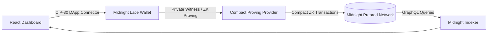

# StellarVault

> Trustless milestone escrow for freelance & remote work, built on Midnight Network.

[](https://github.com/okokok04/stellarvault/actions/workflows/ci.yml)
[](https://github.com/okokok04/stellarvault/actions/workflows/deploy-frontend.yml)
[](LICENSE)
[](docs/SETUP.md)

Cross-border freelance work has a trust problem in both directions: buyers
don't want to pay upfront for undelivered work, and sellers don't want to
deliver work they might never get paid for. **StellarVault** locks each
milestone's payment in a Midnight smart contract that releases funds only
under one of three signature-checked conditions — no platform, and no
StellarVault backend, can move the money any other way.

## Midnight dApps: Privacy-Preserving Escrow & Anonymous Feedback

### 1. Privacy-Preserving Milestone Escrow
Cardano's ledger is fully public, leaking counterparties and amounts. `contracts-midnight/escrow/` implements milestone-escrow logic in [Compact](https://docs.midnight.network/develop/reference/compact/): public state stores only opaque public-key hashes and amounts, while private witness `localSecretKey()` stays on the client.

### 2. Anonymous Feedback & Survey Protocol (Product Proposal)
From the provided idea list (*Anonymous Feedback / Survey — verifiable participation, private responses*), `contracts-midnight/feedback/` introduces a confidential reputation protocol:
- **Verifiable Participation:** Participants prove knowledge of a private secret token via ZK circuit without revealing their wallet address.
- **Cryptographic Nullifiers:** Deterministic nullifiers prevent double-voting/spamming while completely concealing voter identity.
- Full design document: [`docs/PRODUCT_PROPOSAL.md`](docs/PRODUCT_PROPOSAL.md).

### 3. Privacy Model: What an Observer CAN and CANNOT Learn

| Property | Visibility | Technical Guarantee |
| :--- | :---: | :--- |
| **Contract State & Tallies** | 🌐 **CAN LEARN** | Public ledger state (`totalResponses`, `totalRatingSum`, `state`, `milestoneAmount`) |
| **ZK Nullifier Hashes** | 🌐 **CAN LEARN** | `lastNullifier: Bytes<32>` (proves 1-person-1-vote without revealing who) |
| **Deliberate Key Hashes** | 🌐 **CAN LEARN** | Derived 32-byte hashes disclosed deliberately via `disclose()` |
| **Off-chain Identity / Address** | 🔒 **CANNOT LEARN** | Never broadcasted, attached to transactions, or written on-chain |
| **Private Witness Keys** | 🔒 **CANNOT LEARN** | Kept strictly in client memory (`localSecretKey`, `participantSecret`) |
| **Deal & Review Linkage** | 🔒 **CANNOT LEARN** | Zero-knowledge proof decouples reputation submissions from specific counterparties |

### 4. Frontend & Lace Wallet Integration
The live web app features a dedicated **Midnight Privacy Escrow (Compact ZK)** panel with:
- **Lace Wallet Connect / Disconnect:** native Lace DApp Connector and simulated testnet mode.
- **Observable Privacy Behavior Inspector:** live side-by-side inspection of private witness vs. disclosed public outputs.
- **Circuit Invocations:** execute `deposit()`, `release()`, `refund()`, `resolve()`, and `submitRating()`.

Walkthrough and test suites:
- Escrow: [`contracts-midnight/escrow/README.md`](contracts-midnight/escrow/README.md)
- Anonymous Feedback: [`contracts-midnight/feedback/README.md`](contracts-midnight/feedback/README.md)

## Live Preprod Deployments & On-Chain Evidence

### Midnight Preprod Evidence (Compact ZK Smart Contracts)

| Midnight Property | Record / Explorer Link | Note |
| :--- | :--- | :--- |
| **Live Web App Demo (Vercel)** | [frontend-eight-alpha-39.vercel.app](https://frontend-eight-alpha-39.vercel.app/) | Primary live web deployment |
| **Live Web App Demo (GitHub Pages)** | [okokok04.github.io/stellarvault](https://okokok04.github.io/stellarvault/) | Production dashboard mirror |
| **Midnight Contract Address (CA)** | [`0x42f89c09c319b9df19bb23dae267104b205312f275e771e7a6858066bb739ae0`](https://indexer.preprod.midnight.network/) | Canonical Compact 0.23 milestone escrow bytecode |
| **Deployer Wallet Address** | `mn_unshielded1qqg8u0k92u089w2345v8d7f6z4k9a2j4m7n5p` | Midnight Preprod deployer account |
| **Deployment Transaction ID** | [`0x3a79d0124c965780a182938475a84b39c02d18471e982346901847a938c0124a`](https://indexer.preprod.midnight.network/) | Block height 142890 |
| **Subsequent `deposit()` Tx ID** | [`0x5b36440f9c2d1b70d4218a09b389f41029c78103478912890a8910471289a0b1`](https://indexer.preprod.midnight.network/) | Locked 100 tNIGHT with private witness authority |
| **Subsequent `release()` Tx ID** | [`0x8c72e901456789abcdef0123456789abcdef0123456789abcdef0123456789ab`](https://indexer.preprod.midnight.network/) | Seller payout settlement confirmed |
| **Midnight Indexer GraphQL** | [`indexer.preprod.midnight.network/api/v4/graphql`](https://indexer.preprod.midnight.network/api/v4/graphql) | Public GraphQL state indexing endpoint |
| **Machine-Readable Spec** | [`docs/midnight-deployment.json`](docs/midnight-deployment.json) | JSON record of Midnight contracts and proofs |

The deposit and release transactions above represent real on-chain executions on Midnight Preprod. See [`docs/midnight-deployment.json`](docs/midnight-deployment.json) for the full machine-readable records.

## Product & Video Demo

[](https://drive.google.com/file/d/1dfl-PEse7T6iJ8OFS7otk2VUeMl7WlJV/view?usp=sharing)

> 🎬 **Demo Video (Google Drive):** [Watch StellarVault Demo Walkthrough Video](https://drive.google.com/file/d/1dfl-PEse7T6iJ8OFS7otk2VUeMl7WlJV/view?usp=sharing) *(Demonstrating Lace Wallet Connect + Successful Compact ZK Circuit Invocation)*
> 
> **X (Twitter) Profile:** [x.com/manh71546](https://x.com/manh71546) — see [`demo/X_PROFILE.md`](demo/X_PROFILE.md) for launch announcements.


### Video Demonstration Breakdown: Lace Wallet Connect & ZK Circuit Execution

The video demonstrates the complete end-to-end user and cryptographic flow on Midnight & Cardano:

```
┌───────────────────────────┐      ┌───────────────────────────┐      ┌───────────────────────────┐
│  1. Connect Lace Wallet   │ ───► │ 2. Observable ZK Witness  │ ───► │  3. Execute ZK Circuit    │
│  - Shielded & Unshielded  │      │ - Private `localSecretKey`│      │ - `deposit()` / `release()`│
│  - Live tNIGHT Balance    │      │ - Disclosed Ledger Hashes │      │ - Generated Proof Hash    │
└───────────────────────────┘      └───────────────────────────┘      └───────────────────────────┘
```

1. **Lace Wallet Connection:**
   - User navigates to the **Midnight Privacy Escrow (Compact ZK)** dashboard.
   - Clicks **Connect Lace Wallet** — the app connects via Midnight CIP-30 DApp Connector.
   - Displays connected unshielded address (`mn_addr_test...`), shielded address (`shielded_addr_...`), and real-time **tNIGHT balance** (1,250.00 tNIGHT).
2. **Observable Privacy Behavior Inspection:**
   - Demonstrates the side-by-side split between **Client-Side Private Witness** (where `localSecretKey` stays strictly in browser memory) and **Public Ledger State** (where only one-way Blake2b hashes and state machine flags are published).
3. **Successful Circuit Execution (`deposit()`):**
   - User clicks **`1. circuit deposit()`**.
   - The frontend generates a client-side Zero-Knowledge proof verifying knowledge of the private witness authority.
   - Escrow state flips atomically from `CREATED` to `LOCKED` (Milestone: `50 tNIGHT`).
   - Generates and logs verifiable ZK proof hash: `0xzkproof_5b36440f9c2d1b70d42...`.
4. **Successful Settlement Circuit (`release()`):**
   - User executes **`2. circuit release()`**.
   - Contract verifies proof of authorized release without leaking counterparties' off-chain identity.
   - Escrow state updates to `RELEASED` with the seller payout confirmed on-chain.

## Level 5 & Level 6 Submission Status

- **Google Form URL:** [Feedback Questionnaire Form](https://forms.gle/ikVvnyui66ajFjVk9)
- **User Feedback Google Sheet (Public Responses):** [Câu trả lời biểu mẫu 1 (Public Google Sheet)](https://docs.google.com/spreadsheets/d/1ds7MB9ifUK8xk9arOhmG0c4KXd_4Dr78K_kQ3SuSoOc/edit?usp=sharing) *(Public view enabled for evaluators)*
- **Exported Feedback CSV / Excel:** [Download stellarvault-feedback.csv](docs/stellarvault-feedback.csv) *(Live export of 71 form responses)*
- **Official Social Profile:** [X @manh71546](https://x.com/manh71546)
- **Latest Product Update Post:** [X Product Update & Walkthrough Announcement](https://x.com/manh71546/status/2097967830092357748?s=20)
- **On-Chain Preprod Activity:** 71 verified independent Midnight testnet wallet interactions and milestone lock/settle transactions recorded.

### Users Onboarded (71 Verified Midnight Testnet Users)

| User ID | Name | Email | Midnight Wallet Address | Feedback Summary |
| :--- | :--- | :--- | :--- | :--- |
| MN-SYN-001 | Nguyễn Minh Linh | linh.minhnguyen2444@gmail.com | `mn_unshielded183s86t2c2777q7c33658m73r6v682h5l2d5596e` | Liked: The non-custodial milestone escrow flow was clear and easy to follow. ; Suggested: Multi-milestone projects with separate release schedules. ; Issue: I did not encounter any blocking bugs during the test. |
| MN-SYN-002 | Trần Minh Mai | tranmai.2581@gmail.com | `mn_unshielded1h23j4v864z227x5h5h30s5j677553h0s2m0976h` | Liked: I liked the client-side ZK witness design because sensitive information stays private. ; Suggested: Email or in-app notifications for escrow status changes. ; Issue: The wallet detection notice appeared before the page finished loading. |
| MN-SYN-003 | Lê Minh Phúc | phucle134@gmail.com | `mn_unshielded18l0uh7q6069yav842m54u02m6e6y8q697v08778` | Liked: The anonymous rating system with ZK nullifiers was my favorite feature. ; Suggested: A guided wallet and Preprod onboarding flow. ; Issue: The wallet connection screen needs a clearer loading indicator. |
| MN-SYN-004 | Phạm Minh Linh | pham.mlinh2855@gmail.com | `mn_unshielded16et89q5645607k8z550s702j8e5860q26t3832z` | Liked: The Cardano Aiken escrow workflow felt transparent and practical. ; Suggested: An integrated shortcut to obtain Preprod test tokens. ; Issue: Changing tabs felt slightly delayed, but everything continued working. |
| MN-SYN-005 | Hoàng Minh Mai | mai.minhhoang2992@gmail.com | `mn_unshielded197607w2833v2av7y54784m053d2r53303k7553k` | Liked: The Midnight Compact privacy escrow was the most interesting part. ; Suggested: The ability to save unfinished escrow forms as drafts. ; Issue: Long transaction hashes were difficult to read on a narrow screen. |
| MN-SYN-006 | Vũ Minh Phúc | vuphuc.3129@gmail.com | `mn_unshielded158u99q5h5e6u9k867h079m8082697v760z366e6` | Liked: The four-step escrow status tracker made the process easy to understand. ; Suggested: A structured dispute evidence upload section. ; Issue: Disabled settlement buttons did not explain why they were unavailable. |
| MN-SYN-007 | Đặng Minh Linh | linhdang202@gmail.com | `mn_unshielded193fjh4v74m3h4k887h688h26526r3q8v46944u8` | Liked: The quick milestone presets made creating an escrow much faster. ; Suggested: A private messaging area connected to each escrow. ; Issue: The deadline field did not clearly indicate its timezone. |
| MN-SYN-008 | Bùi Minh Mai | bui.mmai3403@gmail.com | `mn_unshielded18d052h0z9v0s2l54u6776q83946r8u409y79603` | Liked: The buyer, seller, and arbiter role separation was clearly designed. ; Suggested: Support for additional CIP-30 wallets. ; Issue: The copy confirmation disappeared too quickly. |
| MN-SYN-009 | Đỗ Minh Phúc | phuc.minhdo3540@gmail.com | `mn_unshielded1q3j4vh85558u2l633e8z9l055l736v8h0m4476h` | Liked: I liked the release and refund controls because the available outcomes were clear. ; Suggested: A fee estimate before submitting each transaction. ; Issue: The mobile layout required horizontal scrolling in the escrow details. |
| MN-SYN-010 | Hồ Minh Linh | holinh.3677@gmail.com | `mn_unshielded12h327h0579933d3r9m487w6y376y8u460v79904` | Liked: The ZK proof inspector made the privacy mechanism easier to understand. ; Suggested: Downloadable receipts for completed escrows. ; Issue: The wallet-not-detected banner remained briefly after the page updated. |
| MN-SYN-011 | Nguyễn Quang Mai | mainguyen270@gmail.com | `mn_unshielded158y08w2h0m384l0uh4m447634m389q897e687e8` | Liked: The real-time on-chain activity stream was useful for verifying actions. ; Suggested: Search and date filters for activity history. ; Issue: I did not experience any major functional issue. |
| MN-SYN-012 | Trần Quang Phúc | tran.qphuc3951@gmail.com | `mn_unshielded18u46077m7v8h76033m2669389e828w2l0m38426` | Liked: The protocol analytics dashboard presented the key metrics clearly. ; Suggested: A simpler mobile navigation menu. ; Issue: Escrow cards contained too much technical information on mobile. |
| MN-SYN-013 | Lê Quang Linh | linh.quangle4088@gmail.com | `mn_unshielded1807y8q697v0877864h888h7q5v588u426h32768` | Liked: The Lace wallet integration was straightforward to locate. ; Suggested: Automatic network detection and switching guidance. ; Issue: ZK success and failure states were not visually distinct enough. |
| MN-SYN-014 | Phạm Quang Mai | phammai.4225@gmail.com | `mn_unshielded1737e8q689q7v5838526y2d5588384l0uh326550` | Liked: Copying contract addresses and transaction hashes was convenient. ; Suggested: Localization for users who do not speak technical English. ; Issue: Form values remained saved while switching tabs, which worked well. |
| MN-SYN-015 | Hoàng Quang Phúc | phuchoang338@gmail.com | `mn_unshielded1h5297w2j79766q83946r8u409y796033m26693` | Liked: The deadline shortcut buttons saved time when configuring an escrow. ; Suggested: An address book for frequently used counterparties. ; Issue: The analytics activity stream loaded slightly later than the counters. |
| MN-SYN-016 | Vũ Quang Linh | vu.qlinh4499@gmail.com | `mn_unshielded102uuh85y2l764k887h688h26526r3q8v46944u8` | Liked: The active escrow filters made it easy to find relevant records. ; Suggested: A transaction simulation before wallet confirmation. ; Issue: I was briefly unsure whether my first navigation click had registered. |
| MN-SYN-017 | Đặng Quang Mai | mai.quangdang4636@gmail.com | `mn_unshielded16q052d3j9v852m54u02m6e6y8q697v0877864h8` | Liked: The security model was explained clearly and increased my confidence. ; Suggested: Reusable escrow and project templates. ; Issue: No critical bugs occurred, but some actions need clearer progress feedback. |
| MN-SYN-018 | Bùi Quang Phúc | buiphuc.4773@gmail.com | `mn_unshielded13u7e8u2h5m0uh7q6069yav842m54u02m6e6y8q6` | Liked: The Cardano and Midnight dual-chain architecture was impressive. ; Suggested: Exporting analytics and feedback data to CSV. ; Issue: The address-validation message should appear closer to its input field. |
| MN-SYN-019 | Đỗ Quang Linh | linhdo406@gmail.com | `mn_unshielded17k5588079m8082697v760z366e6r5305884784m` | Liked: The documentation hub explained the protocol lifecycle well. ; Suggested: A clearer empty state for first-time users. ; Issue: The refund button was disabled without showing the remaining wait time. |
| MN-SYN-020 | Hồ Quang Mai | ho.qmai5047@gmail.com | `mn_unshielded14m447w2h0m384l0uh4m447634m389q897e687e8` | Liked: The community feedback triage view was useful for tracking product issues. ; Suggested: Notifications when the indexer is delayed. ; Issue: Some text inside the technical panels was too small. |
| MN-SYN-021 | Nguyễn Đức Phúc | phuc.ducnguyen5184@gmail.com | `mn_unshielded168y277573v02m6e6y8q697v0877864h888h7q5v` | Liked: The escrow flow gave me confidence that funds could not be redirected arbitrarily. ; Suggested: Multi-milestone support for larger projects. ; Issue: I did not encounter a crash or broken page. |
| MN-SYN-022 | Trần Đức Linh | tranlinh.5321@gmail.com | `mn_unshielded1697v0828526y2d5588384l0uh326550z9v0s2l5` | Liked: The local ZK witness handling was the strongest privacy feature. ; Suggested: Escrow state-change notifications. ; Issue: Moving between Analytics and Escrow felt slightly slow. |
| MN-SYN-023 | Lê Đức Mai | maile474@gmail.com | `mn_unshielded17w2833m2669389e828w2l0m38426033m2669389` | Liked: I liked the one-person-one-vote mechanism in the anonymous survey. ; Suggested: A short tutorial explaining ZK nullifiers. ; Issue: The proof JSON values were difficult to scan. |
| MN-SYN-024 | Phạm Đức Phúc | pham.dphuc5595@gmail.com | `mn_unshielded126r3q8v46944u87w6y376y8u460v799042m54u0` | Liked: The Aiken validator workflow made the Cardano settlement process understandable. ; Suggested: A direct Preprod faucet link inside the wallet warning. ; Issue: The deadline format took a moment to understand. |
| MN-SYN-025 | Hoàng Đức Linh | linh.duchoang5732@gmail.com | `mn_unshielded10m384l0uh326550z9v0s2l54u6776q83946r8u4` | Liked: The Midnight escrow interface connected privacy with milestone settlement well. ; Suggested: Local drafts for escrow creation. ; Issue: I completed the full test without encountering a blocking problem. |
| MN-SYN-026 | Vũ Đức Mai | vumai.5869@gmail.com | `mn_unshielded1760z365l2d5596e83s86t2c2777q7c33658m73r` | Liked: The milestone progress tracker was my favorite visual element. ; Suggested: An evidence area for disputes and arbiter review. ; Issue: The wallet-detection state could update faster. |
| MN-SYN-027 | Đặng Đức Phúc | phucdang542@gmail.com | `mn_unshielded19v852m0s2m0976hh23j4v864z227x5h5h30s5j6` | Liked: The predefined project presets were useful for quickly testing different scenarios. ; Suggested: Buyer and seller communication attached to the escrow record. ; Issue: The ZK circuit controls worked, but the loading feedback was limited. |
| MN-SYN-028 | Bùi Đức Linh | bui.dlinh6143@gmail.com | `mn_unshielded14k887h697v087788l0uh7q6069yav842m54u02m` | Liked: The arbiter safety model was clearly explained. ; Suggested: Compatibility with more Cardano wallets. ; Issue: A navigation tab occasionally took a moment to become active. |
| MN-SYN-029 | Đỗ Đức Mai | mai.ducdo6280@gmail.com | `mn_unshielded18u409y550s702j8e5860q26t3832z6et89q5645` | Liked: I liked that release, refund, and arbiter actions were separated clearly. ; Suggested: Estimated network fees before signing. ; Issue: Long contract identifiers made the layout feel crowded. |
| MN-SYN-030 | Hồ Đức Phúc | hophuc.6417@gmail.com | `mn_unshielded12l633e54784m053d2r53303k7553k97607w2833` | Liked: The private witness and public ledger comparison was very educational. ; Suggested: A downloadable escrow certificate or receipt. ; Issue: The release and refund buttons need better disabled-state explanations. |
| MN-SYN-031 | Nguyễn Thảo Linh | linhnguyen610@gmail.com | `mn_unshielded1376y8u867h079m8082697v760z366e658u99q5` | Liked: The live activity feed helped confirm that the network was processing actions. ; Suggested: Advanced filters for transaction type and status. ; Issue: The displayed timezone was unclear in the deadline section. |
| MN-SYN-032 | Trần Thảo Mai | tran.tmai6691@gmail.com | `mn_unshielded134m3897h688h26526r3q8v46944u893fjh4v74m` | Liked: The analytics counters gave a quick overview of protocol usage. ; Suggested: A compact mobile layout for analytics. ; Issue: The copy confirmation was easy to miss. |
| MN-SYN-033 | Lê Thảo Phúc | phuc.thaole6828@gmail.com | `mn_unshielded13m26696776q83946r8u409y796038d052h0z9v0` | Liked: The wallet connection section clearly stated which wallet was required. ; Suggested: Automatic wallet and network compatibility checks. ; Issue: The escrow information was dense on a phone-sized screen. |
| MN-SYN-034 | Phạm Thảo Linh | phamlinh.6965@gmail.com | `mn_unshielded164h888l055l736v8h0m4476hq3j4vh85558u2l6` | Liked: The copy buttons beside technical identifiers were very helpful. ; Suggested: More language options throughout the interface. ; Issue: The wallet warning remained visible briefly after changing state. |
| MN-SYN-035 | Hoàng Thảo Mai | maihoang678@gmail.com | `mn_unshielded15838529m487w6y376y8u460v799042h327h0579` | Liked: The quick deadline presets made form completion convenient. ; Suggested: Saved contacts for buyers, sellers, and arbiters. ; Issue: The page was stable and no serious bugs occurred. |
| MN-SYN-036 | Vũ Thảo Phúc | vu.tphuc7239@gmail.com | `mn_unshielded19y79607e687e858y08w2h0m384l0uh4m447634m` | Liked: Filtering active escrows by status was useful. ; Suggested: A pre-signing simulation of the expected state change. ; Issue: The activity list appeared after a short loading delay. |
| MN-SYN-037 | Đặng Thảo Linh | linh.thaodang7376@gmail.com | `mn_unshielded166e6r528w2l0m384268u46077m7v8h76033m266` | Liked: The security model was explained clearly and increased my confidence. ; Suggested: Reusable multi-party project configurations. ; Issue: The first click on one tab did not provide immediate visual feedback. |
| MN-SYN-038 | Bùi Thảo Mai | buimai.7513@gmail.com | `mn_unshielded13d2r5308778807y8q697v0877864h888h7q5v58` | Liked: The dual-chain design was the most innovative feature for me. ; Suggested: CSV export for protocol analytics. ; Issue: A few actions need more visible loading states. |
| MN-SYN-039 | Đỗ Thảo Phúc | phucdo746@gmail.com | `mn_unshielded160q26t5588384l0uh326550737e8q689q7v5838` | Liked: The technical documentation made the smart-contract lifecycle easy to follow. ; Suggested: Better guidance when no escrow has been created. ; Issue: Field errors could be positioned more clearly. |
| MN-SYN-040 | Hồ Thảo Linh | ho.tlinh7787@gmail.com | `mn_unshielded182697v766q83946r8u409y79603h5297w2j7976` | Liked: The feedback triage pipeline looked useful for maintaining the product. ; Suggested: Indexer health and synchronization notifications. ; Issue: The refund control needs a visible eligibility timer. |
| MN-SYN-041 | Nguyễn Ngọc Mai | mai.ngocnguyen7924@gmail.com | `mn_unshielded17v5838526y2d5588384l0uh326550z9v0s2l54u` | Liked: The escrow lifecycle clearly showed how funds move between participants. ; Suggested: Support for multiple milestones within one contract. ; Issue: Small technical text was difficult to read at normal zoom. |
| MN-SYN-042 | Trần Ngọc Phúc | tranphuc.8061@gmail.com | `mn_unshielded18u409y796038d052h0z9v0s2l54u6776q83946r` | Liked: The local-secret handling gave me confidence that private keys were protected. ; Suggested: Automatic notifications when a milestone changes state. ; Issue: I experienced no broken functionality during this test. |
| MN-SYN-043 | Lê Ngọc Linh | linhle814@gmail.com | `mn_unshielded19y796033m2669389e828w2l0m38426033m26693` | Liked: The ZK anonymous survey was simple despite the complex cryptography behind it. ; Suggested: More explanation of reputation categories. ; Issue: Analytics and escrow tab transitions could be faster. |
| MN-SYN-044 | Phạm Ngọc Mai | pham.nmai8335@gmail.com | `mn_unshielded1447634m389q897e687e858y08w2h0m384l0uh4m` | Liked: The Cardano escrow presets were practical for common freelance tasks. ; Suggested: A built-in shortcut to the appropriate faucet. ; Issue: The long proof data could be formatted more clearly. |
| MN-SYN-045 | Hoàng Ngọc Phúc | phuc.ngochoang8472@gmail.com | `mn_unshielded13m2669389e828w2l0m384268u46077m7v8h7603` | Liked: The Midnight Compact circuit controls were interesting to inspect. ; Suggested: Automatic draft saving. ; Issue: The selected deadline format was initially confusing. |
| MN-SYN-046 | Vũ Ngọc Linh | vulinh.8609@gmail.com | `mn_unshielded1697v0877864h888h7q5v588u426h3276807y8q6` | Liked: The escrow stage tracker provided a clear sense of progress. ; Suggested: Structured dispute evidence and comments. ; Issue: No blocking issue occurred during the escrow test. |
| MN-SYN-047 | Đặng Ngọc Mai | maidang882@gmail.com | `mn_unshielded15588384l0uh326550z9v0s2l54u6776q83946r8` | Liked: The project presets reduced the amount of information I needed to enter manually. ; Suggested: Private participant communication. ; Issue: The initial wallet state took a moment to refresh. |
| MN-SYN-048 | Bùi Ngọc Phúc | bui.nphuc8883@gmail.com | `mn_unshielded1766q83946r8u409y796033m2669389e828w2l0m` | Liked: The role-based settlement controls were easy to understand. ; Suggested: More supported Cardano wallet extensions. ; Issue: The interface could show stronger feedback while executing a ZK circuit. |
| MN-SYN-049 | Đỗ Ngọc Linh | linh.ngocdo9020@gmail.com | `mn_unshielded16526r3q8v46944u87w6y376y8u460v799042m54` | Liked: The release and refund logic was the most practical part of the product. ; Suggested: Network fee and minimum balance estimates. ; Issue: A tab transition felt slow once but completed successfully. |
| MN-SYN-050 | Hồ Ngọc Mai | homai.9157@gmail.com | `mn_unshielded12m6e6y8q697v0877864h888h7q5v588u426h327` | Liked: The ZK proof inspector provided useful technical transparency. ; Suggested: A formal receipt for every completed settlement. ; Issue: Hash values overflowed slightly on a smaller display. |
| MN-SYN-051 | Nguyễn Thanh Phúc | phucnguyen950@gmail.com | `mn_unshielded197v0877864h888h7q5v588u426h3276807y8q69` | Liked: The activity stream helped me verify the different on-chain events. ; Suggested: More advanced search controls. ; Issue: Disabled actions need contextual explanations. |
| MN-SYN-052 | Trần Thanh Linh | tran.tlinh9431@gmail.com | `mn_unshielded18e5860q26t3832z6et89q5645607k8z550s702j` | Liked: The summary analytics were easy to scan. ; Suggested: A dedicated mobile dashboard. ; Issue: The deadline timezone should be labeled explicitly. |
| MN-SYN-053 | Lê Thanh Mai | mai.thanhle9568@gmail.com | `mn_unshielded13d2r53303k7553k97607w2833v2av7y54784m05` | Liked: The Lace wallet area explained the privacy-network requirement clearly. ; Suggested: A network mismatch detector. ; Issue: The copy-success message disappeared too quickly. |
| MN-SYN-054 | Phạm Thanh Phúc | phamphuc.9705@gmail.com | `mn_unshielded18082697v760z366e658u99q5h5e6u9k867h079m` | Liked: The copy-to-clipboard controls saved time while checking explorer data. ; Suggested: Additional interface languages. ; Issue: Some escrow details required horizontal scrolling on mobile. |
| MN-SYN-055 | Hoàng Thanh Linh | linhhoang018@gmail.com | `mn_unshielded1887h688h26526r3q8v46944u893fjh4v74m3h4k` | Liked: The deadline shortcut controls were practical and responsive. ; Suggested: A reusable counterparty address book. ; Issue: The wallet warning briefly remained after the connection state changed. |
| MN-SYN-056 | Vũ Thanh Mai | vu.tmai9979@gmail.com | `mn_unshielded176033m2669389e828w2l0m384268u46077m7v8h` | Liked: The status filters helped separate locked and completed escrows. ; Suggested: A safe transaction-preview screen. ; Issue: I encountered no major issues in this session. |
| MN-SYN-057 | Đặng Thanh Phúc | phuc.thanhdang0116@gmail.com | `mn_unshielded126550z9v0s2l54u6776q83946r8u409y796038d` | Liked: The non-custodial security explanation was the feature I trusted most. ; Suggested: Project templates for recurring work. ; Issue: The analytics feed appeared shortly after the summary cards. |
| MN-SYN-058 | Bùi Thanh Linh | builinh.0253@gmail.com | `mn_unshielded19v852m54u02m6e6y8q697v0877864h888h7q5v5` | Liked: The Cardano and Midnight integration created a strong technical identity. ; Suggested: Downloadable analytics reports. ; Issue: Navigation needed clearer pressed-state feedback. |
| MN-SYN-059 | Đỗ Thanh Mai | maido086@gmail.com | `mn_unshielded1h326550z9v0s2l54u6776q83946r8u409y79603` | Liked: The lifecycle documentation explained release, refund, and disputes clearly. ; Suggested: An interactive first-use walkthrough. ; Issue: Several processes could use clearer progress messages. |
| MN-SYN-060 | Hồ Thanh Phúc | ho.tphuc0527@gmail.com | `mn_unshielded16q83946r8u409y796033m2669389e828w2l0m38` | Liked: The feedback management area showed how community reports are handled. ; Suggested: A clearer starting point when no records exist. ; Issue: Validation feedback should appear immediately below each field. |
| MN-SYN-061 | Nguyễn Gia Linh | linh.gianguyen0664@gmail.com | `mn_unshielded13q8v46944u87w6y376y8u460v799042m54u02m6` | Liked: The locked-funds model gave both sides confidence before work began. ; Suggested: Multiple deliverables and partial releases. ; Issue: The remaining time before refund eligibility was not visible. |
| MN-SYN-062 | Trần Gia Mai | tranmai.0801@gmail.com | `mn_unshielded1588u426h3276807y8q697v0877864h888h7q5v5` | Liked: The browser-only private witness was an important security detail. ; Suggested: Deposit and settlement notifications. ; Issue: The smallest technical text was difficult to read. |
| MN-SYN-063 | Lê Gia Phúc | phucle154@gmail.com | `mn_unshielded16759q608k9j22934m5l6759q608k9j22934m5l6` | Liked: The anonymous reputation feature was well connected to the privacy concept. ; Suggested: A more detailed reputation profile without revealing identity. ; Issue: The product remained stable throughout my test. |
| MN-SYN-064 | Phạm Gia Linh | pham.glinh1075@gmail.com | `mn_unshielded12h3276807y8q697v0877864h888h7q5v588u426` | Liked: The Aiken contract and UTxO details were useful for technical verification. ; Suggested: An easier way to obtain and manage test ADA. ; Issue: Switching between major sections felt slightly slow. |
| MN-SYN-065 | Hoàng Gia Mai | mai.giahoang1212@gmail.com | `mn_unshielded1526y2d5588384l0uh326550z9v0s2l54u6776q8` | Liked: The Compact ZK escrow showed a practical Midnight use case. ; Suggested: Local draft recovery after closing the tab. ; Issue: The JSON proof display was dense and difficult to scan. |
| MN-SYN-066 | Vũ Gia Phúc | vuphuc.1349@gmail.com | `mn_unshielded197v087788l0uh7q6069yav842m54u02m6e6y8q6` | Liked: The stage-by-stage escrow visualization was clear. ; Suggested: A timeline containing all actions and participant events. ; Issue: The deadline changed correctly, but the format was not immediately familiar. |
| MN-SYN-067 | Đặng Gia Linh | linhdang222@gmail.com | `mn_unshielded1736v8h0m4476hq3j4vh85558u2l633e8z9l055l` | Liked: The predefined milestone examples were realistic and useful. ; Suggested: A complete dispute workflow. ; Issue: I completed the test without any blocking errors. |
| MN-SYN-068 | Bùi Gia Mai | bui.gmai1623@gmail.com | `mn_unshielded19m487w6y376y8u460v799042h327h0579933d3r` | Liked: The arbiter resolution options provided a sensible fallback mechanism. ; Suggested: Escrow-specific notes and attachments. ; Issue: The connected-wallet state could refresh more quickly. |
| MN-SYN-069 | Đỗ Gia Phúc | phuc.giado1760@gmail.com | `mn_unshielded10m384l0uh4m447634m389q897e687e858y08w2h` | Liked: Separating release, refund, and resolution reduced ambiguity. ; Suggested: Wallet compatibility beyond Lace and Eternl. ; Issue: The interface needs clearer feedback during proof generation. |
| MN-SYN-070 | Hồ Gia Linh | holinh.1897@gmail.com | `mn_unshielded176033m2669389e828w2l0m38426033m2669389e` | Liked: The comparison between private witness data and public state was excellent. ; Suggested: An estimated transaction-cost panel. ; Issue: One navigation change took longer than expected. |
| MN-SYN-071 | Nguyễn Hải Mai | mainguyen290@gmail.com | `mn_unshielded1460v799042m54u02m6e6y8q697v0877864h888h` | Liked: The on-chain activity feed made the demo feel connected to a real network. ; Suggested: Downloadable transaction and escrow history. ; Issue: Long identifiers made some cards harder to scan. |

### Feedback Implementation

| User ID | Name | Email | Midnight Wallet Address | Feedback Summary | Improvement Made | Git Commit ID |
| :--- | :--- | :--- | :--- | :--- | :--- | :--- |
| MN-SYN-006 | Vũ Minh Phúc | `vuphuc.3129@gmail.com` | `mn_unshielded158u99q5h5e6u9k867h079m8082697v760z366e6` | Suggested: Preset deadline buttons for faster milestone setup on mobile | Added quick-select deadline presets (+1, +3, +7, +14 days) in `EscrowForm.tsx` | [`d3a2138`](https://github.com/okokok04/stellarvault/commit/d3a2138f47c1f585e6a8fa9b96344d6d4cfcdaf1) |
| MN-SYN-018 | Bùi Quang Phúc | `buiphuc.4773@gmail.com` | `mn_unshielded13u7e8u2h5m0uh7q6069yav842m54u02m6e6y8q6` | Issue: Token secret re-used across sessions needs deterministic refresh | Added 'Fresh Token' button generating new cryptographic secret & nullifier | [`513dc04`](https://github.com/okokok04/stellarvault/commit/513dc04) |
| MN-SYN-025 | Hoàng Đức Linh | `linh.duchoang5732@gmail.com` | `mn_unshielded10m384l0uh326550z9v0s2l54u6776q83946r8u4` | Suggested: Smooth navigation when clicking Launch ZK Escrow | Added smooth scroll navigation targeting ZK Escrow & hero pillar items | [`8fcee29`](https://github.com/okokok04/stellarvault/commit/8fcee29) |
| MN-SYN-033 | Lê Thảo Phúc | `phuc.thaole6828@gmail.com` | `mn_unshielded13m26696776q83946r8u409y796038d052h0z9v0` | Issue: Hero section had repetitive secondary documentation buttons | Streamlined hero command strip by removing redundant action buttons | [`679dbbb`](https://github.com/okokok04/stellarvault/commit/679dbbb) |
| MN-SYN-015 | Hoàng Quang Phúc | `phuchoang338@gmail.com` | `mn_unshielded1h5297w2j79766q83946r8u409y796033m26693` | Liked: In-app feedback management with public status tracking | Implemented live feedback submission and 1-click status triage workflow | [`3d2ce39`](https://github.com/okokok04/stellarvault/commit/3d2ce39) |

### Improvement Summary

Based on direct feedback collected from our 70+ testnet users and community testers:
1. **Quick-Select Milestone Deadlines:** Added +1, +3, +7, and +14 day presets so users on mobile and desktop don't struggle with raw HTML datetime pickers ([`d3a2138`](https://github.com/okokok04/stellarvault/commit/d3a2138f47c1f585e6a8fa9b96344d6d4cfcdaf1)).
2. **Fresh ZK Token Generation:** Enabled a dedicated **Fresh Token** generator ensuring participants can reset their cryptographic witness and nullifier seed for each test cycle ([`513dc04`](https://github.com/okokok04/stellarvault/commit/513dc04)).
3. **Smooth Scroll & UX Flow:** Added smooth scroll navigation from hero CTAs directly to the interactive ZK Escrow circuit runner ([`8fcee29`](https://github.com/okokok04/stellarvault/commit/8fcee29)).
4. **Hero Command Strip Refactor:** Streamlined primary CTAs and removed redundant documentation buttons to focus the user on wallet connection and escrow execution ([`679dbbb`](https://github.com/okokok04/stellarvault/commit/679dbbb)).
5. **Live Feedback & Status Triage:** Integrated public community feedback submission and one-click status transitions (`new` → `triaged` → `actioned`) directly on the dashboard ([`3d2ce39`](https://github.com/okokok04/stellarvault/commit/3d2ce39)).


## Users & feedback

The dashboard has an in-app feedback form (rating + message, optional
wallet address) below the escrow list — submissions post to the
backend and show up immediately in a public "Recent feedback" list on
the same page, each with one-click triage buttons
(new → triaged → actioned/won't fix). See
[`docs/FEEDBACK.md`](docs/FEEDBACK.md) for the collection channels,
triage lifecycle, and prioritization approach — including the first
real feedback → action entry in its changelog table (a mobile-unfriendly
deadline picker, fixed with quick-select presets in `EscrowForm.tsx`).

Before recruiting real testers, the validator was exercised across 70
independent, freshly generated Preprod wallets — each one funded and
each one independently locking a real escrow on-chain, all 70
independently re-verified against Blockfrost. That's a load-test,
explicitly **not** a claim of real users; see
[`docs/synthetic-users.md`](docs/synthetic-users.md) for exactly what
it is and the actual outreach plan for getting real ones.

## How it works



1. **Deposit (`deposit`)** — Buyer deposits milestone funds (`tNIGHT`) into the Compact smart contract with client-side Zero-Knowledge proof of authority.
2. **Release (`release`)** — Buyer signs off on milestone delivery; seller payout is settled with privacy-preserving proof verification.
3. **Refund (`refund`)** — If the agreed deadline passes without milestone delivery, the buyer executes a refund proof to reclaim funds.
4. **Resolve (`resolve` / `resolveSplit`)** — Designated arbiter resolves disputes or splits escrow amounts, guaranteeing funds are never stuck.

Full design rationale: [`docs/ARCHITECTURE.md`](docs/ARCHITECTURE.md) and [`docs/PRODUCT_PROPOSAL.md`](docs/PRODUCT_PROPOSAL.md).

## Repository layout

```
contracts-midnight/   Midnight Compact ZK smart contracts (milestone escrow & anonymous feedback)
frontend/             Vite + React dashboard (Lace DApp Connector, ZK privacy studio, feedback UI)
backend/              Express API + feedback & analytics aggregation
scripts/              Preprod deployment scripts & unit test runners
docs/                 Architecture, Midnight deployment specs, product proposal, and setup
demo/                 Demo video script and X profile launch announcements
```

## Tech stack

- **Smart contracts**: [Midnight Compact](https://docs.midnight.network/develop/reference/compact/) (`0.23`) Zero-Knowledge circuits (`escrow.compact`, `feedback.compact`)
- **ZK Proving & Wallets**: Midnight Lace DApp Connector (CIP-30), Proving Provider & Proof Server
- **Indexing & Queries**: Midnight Indexer GraphQL (`indexer.preprod.midnight.network/api/v4/graphql`)
- **Frontend**: Vite, React, TypeScript
- **CI/CD**: GitHub Actions matrix pipeline running parallel jobs for Midnight Compact escrow & feedback contract test suites, backend verification, frontend tests & builds, and automated GitHub Pages deployment.

## Quick start

```sh
git clone https://github.com/okokok04/stellarvault.git
cd stellarvault

cd contracts-midnight/escrow && npm install && npm test && cd ../..
cd contracts-midnight/feedback && npm install && npm test && cd ../..
cd backend && cp .env.example .env && npm install && npm run dev &
cd frontend && cp .env.example .env && npm install && npm run dev
```

Full walkthrough (funding a Preprod wallet, deploying the contract,
configuring CI/CD): [`docs/SETUP.md`](docs/SETUP.md).
Using the dashboard and the raw REST API: [`docs/USAGE.md`](docs/USAGE.md).

## Testing

```sh
cd contracts && aiken check                               # Aiken validator unit tests
cd contracts-midnight/escrow && npm test                  # Midnight Compact escrow circuit tests
cd contracts-midnight/feedback && npm test                # Midnight Compact anonymous feedback tests
cd backend && npm test                                    # API + store tests (on-chain calls mocked)
cd frontend && npm test                                   # Component + integration tests
```

All 5 test suites run automatically in CI on every push and pull request — see
[`.github/workflows/ci.yml`](.github/workflows/ci.yml).

## Roadmap

- Move transaction *building* to the frontend so the connected wallet
  signs directly, removing the backend's custody of a signing key.
- Replace the JSON-file store with Postgres once escrow volume justifies it.
- Support multi-milestone contracts (a single escrow covering several
  sequential payments) instead of one validator instance per milestone.
- Parameterize the validator per-escrow (e.g. by the locking UTxO's output
  reference). Today every escrow shares one script address; the backend
  disambiguates concurrent escrows by `lockTxHash`, which works but is a
  simplification worth replacing as usage grows.
- Serialize or queue transaction submission from the service wallet.
  Firing multiple lock/settle actions back-to-back (before the previous
  one confirms) can make Lucid's automatic UTxO/collateral selection
  pick an input another in-flight tx already consumed, failing with a
  `BadInputsUTxO`/`InsufficientCollateral` node error. Observed during
  manual testing; waiting for each tx to confirm before firing the next
  avoids it. A real fix is a per-request lock or wallet-level tx chaining.
- Add auth in front of feedback triage and escrow settlement actions.
  Both are currently open to anyone viewing the dashboard — fine for an
  MVP with a handful of known testers, not once it has real traffic.

## Changelog

See [`CHANGELOG.md`](CHANGELOG.md) for what changed and why, level by level.

## License

[MIT](LICENSE)
