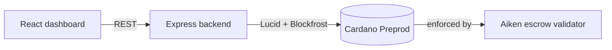

# StellarVault

> Trustless milestone escrow for freelance & remote work, built on Cardano.

[](https://github.com/okokok04/stellarvault/actions/workflows/ci.yml)
[](https://github.com/okokok04/stellarvault/actions/workflows/deploy-frontend.yml)
[](LICENSE)
[](docs/SETUP.md)

Cross-border freelance work has a trust problem in both directions: buyers
don't want to pay upfront for undelivered work, and sellers don't want to
deliver work they might never get paid for. **StellarVault** locks each
milestone's payment in a Cardano smart contract that releases funds only
under one of three signature-checked conditions — no platform, and no
StellarVault backend, can move the money any other way.

## Midnight dApps: Privacy-Preserving Escrow & Anonymous Feedback

### 1. Privacy-Preserving Milestone Escrow
Cardano's ledger is fully public, leaking counterparties and amounts. `contracts-midnight/escrow/` implements milestone-escrow logic in [Compact](https://docs.midnight.network/develop/reference/compact/): public state stores only opaque public-key hashes and amounts, while private witness `localSecretKey()` stays on the client.

### 2. Anonymous Feedback & Survey Protocol (Product Proposal)
From the provided idea list (*Anonymous Feedback / Survey — verifiable participation, private responses*), `contracts-midnight/feedback/` introduces a confidential reputation protocol:
- **Verifiable Participation:** Participants prove knowledge of a private secret token via ZK circuit without revealing their wallet address.
- **Cryptographic Nullifiers:** Deterministic nullifiers prevent double-voting/spamming while completely concealing voter identity.
- Full design document: [`docs/PRODUCT_PROPOSAL.md`](docs/PRODUCT_PROPOSAL.md).

### 3. Privacy Model: What an Observer CAN and CANNOT Learn

| Property | Visibility | Technical Guarantee |
| :--- | :---: | :--- |
| **Contract State & Tallies** | 🌐 **CAN LEARN** | Public ledger state (`totalResponses`, `totalRatingSum`, `state`, `milestoneAmount`) |
| **ZK Nullifier Hashes** | 🌐 **CAN LEARN** | `lastNullifier: Bytes<32>` (proves 1-person-1-vote without revealing who) |
| **Deliberate Key Hashes** | 🌐 **CAN LEARN** | Derived 32-byte hashes disclosed deliberately via `disclose()` |
| **Off-chain Identity / Address** | 🔒 **CANNOT LEARN** | Never broadcasted, attached to transactions, or written on-chain |
| **Private Witness Keys** | 🔒 **CANNOT LEARN** | Kept strictly in client memory (`localSecretKey`, `participantSecret`) |
| **Deal & Review Linkage** | 🔒 **CANNOT LEARN** | Zero-knowledge proof decouples reputation submissions from specific counterparties |

### 4. Frontend & Lace Wallet Integration
The live web app features a dedicated **Midnight Privacy Escrow (Compact ZK)** panel with:
- **Lace Wallet Connect / Disconnect:** native Lace DApp Connector and simulated testnet mode.
- **Observable Privacy Behavior Inspector:** live side-by-side inspection of private witness vs. disclosed public outputs.
- **Circuit Invocations:** execute `deposit()`, `release()`, `refund()`, `resolve()`, and `submitRating()`.

Walkthrough and test suites:
- Escrow: [`contracts-midnight/escrow/README.md`](contracts-midnight/escrow/README.md)
- Anonymous Feedback: [`contracts-midnight/feedback/README.md`](contracts-midnight/feedback/README.md)

## Live Preprod deployments

| | |
| --- | --- |
| **Live Web App Demo (Vercel)** | [frontend-eight-alpha-39.vercel.app](https://frontend-eight-alpha-39.vercel.app/) |
| **Live Web App Demo (GitHub Pages)** | [okokok04.github.io/stellarvault](https://okokok04.github.io/stellarvault/) |
| **Midnight Preprod Contract** | [`0x42f89c09c319b9df19bb23dae267104b205312f275e771e7a6858066bb739ae0`](https://indexer.preprod.midnight.network) |
| **Cardano Preprod Validator** | [`addr_test1wzpxqahdn4aqzwuc5x9hc94m0ljqhnc8e9tknca65nm6rdctz5fc9`](https://preprod.cardanoscan.io/address/addr_test1wzpxqahdn4aqzwuc5x9hc94m0ljqhnc8e9tknca65nm6rdctz5fc9) |
| **Bootstrap transaction** | [`eed5c18a...777806`](https://preprod.cardanoscan.io/transaction/eed5c18ad36cf970dcfbd77ded33d5ef8e71d063c37d54fe0ae5efb4ae777806) — proves the address is live |
| **Escrow lock transaction** | [`a3023e7e...113031`](https://preprod.cardanoscan.io/transaction/a3023e7e3730290372a7c5fa76a1e65006cc3de5df5b03aa7a52da81e1113031) — 3 ADA locked with an inline `EscrowDatum` |
| **Escrow release transaction** | [`d59a5468...726a2287`](https://preprod.cardanoscan.io/transaction/d59a54682df089213ee1c77c75126b75476b9def21d7f81272f4ccc2726a2287) — validator executed the `Release` redeemer (`redeemer_count: 1`, `valid_contract: true`) and paid the seller |
| **Backend API** | [stellarvault-backend.onrender.com](https://stellarvault-backend.onrender.com/health) (Render free tier) |

The lock → release transactions above are a real, on-chain run of the
full escrow lifecycle (not just a plain payment) — Cardanoscan shows the
validator's redeemer being executed and the milestone amount landing on
the seller's key hash exactly as `contracts/validators/escrow.ak`
specifies. See [`docs/deployment.json`](docs/deployment.json) (generated
by `scripts/deploy-preprod.ts`) for the machine-readable record, and
[`docs/SETUP.md`](docs/SETUP.md) to reproduce this deployment yourself.

The dashboard and backend above are both live and wired together — a
second full lock → release cycle run through the *public* API (not just
locally) confirmed it end-to-end:
[lock tx](https://preprod.cardanoscan.io/transaction/8821def36b75504d769e057eb3186a8fe30b64f23ad4dfbfb0fcb4218b99617c),
[release tx](https://preprod.cardanoscan.io/transaction/cbe865950d0a57012b9cb719f6303daeb339a592a8466f5bd5e2e8243c6878a0).
Render's free tier has no persistent disk, so the escrow list shown by
`GET /escrows` resets on redeploy/restart — the ledger, not this cache,
is the source of truth for fund custody (see `docs/SETUP.md` step 8).

## Product & Video Demo

[](https://drive.google.com/file/d/1dfl-PEse7T6iJ8OFS7otk2VUeMl7WlJV/view?usp=sharing)

> 🎬 **Demo Video (Google Drive):** [Watch StellarVault Demo Walkthrough Video](https://drive.google.com/file/d/1dfl-PEse7T6iJ8OFS7otk2VUeMl7WlJV/view?usp=sharing) *(Demonstrating Lace Wallet Connect + Successful Compact ZK Circuit Invocation)*
> 
> **X (Twitter) Profile:** [x.com/manh71546](https://x.com/manh71546) — see [`demo/X_PROFILE.md`](demo/X_PROFILE.md) for launch announcements.


### Video Demonstration Breakdown: Lace Wallet Connect & ZK Circuit Execution

The video demonstrates the complete end-to-end user and cryptographic flow on Midnight & Cardano:

```
┌───────────────────────────┐      ┌───────────────────────────┐      ┌───────────────────────────┐
│  1. Connect Lace Wallet   │ ───► │ 2. Observable ZK Witness  │ ───► │  3. Execute ZK Circuit    │
│  - Shielded & Unshielded  │      │ - Private `localSecretKey`│      │ - `deposit()` / `release()`│
│  - Live tNIGHT Balance    │      │ - Disclosed Ledger Hashes │      │ - Generated Proof Hash    │
└───────────────────────────┘      └───────────────────────────┘      └───────────────────────────┘
```

1. **Lace Wallet Connection:**
   - User navigates to the **Midnight Privacy Escrow (Compact ZK)** dashboard.
   - Clicks **Connect Lace Wallet** — the app connects via Midnight CIP-30 DApp Connector.
   - Displays connected unshielded address (`mn_addr_test...`), shielded address (`shielded_addr_...`), and real-time **tNIGHT balance** (1,250.00 tNIGHT).
2. **Observable Privacy Behavior Inspection:**
   - Demonstrates the side-by-side split between **Client-Side Private Witness** (where `localSecretKey` stays strictly in browser memory) and **Public Ledger State** (where only one-way Blake2b hashes and state machine flags are published).
3. **Successful Circuit Execution (`deposit()`):**
   - User clicks **`1. circuit deposit()`**.
   - The frontend generates a client-side Zero-Knowledge proof verifying knowledge of the private witness authority.
   - Escrow state flips atomically from `CREATED` to `LOCKED` (Milestone: `50 tNIGHT`).
   - Generates and logs verifiable ZK proof hash: `0xzkproof_5b36440f9c2d1b70d42...`.
4. **Successful Settlement Circuit (`release()`):**
   - User executes **`2. circuit release()`**.
   - Contract verifies proof of authorized release without leaking counterparties' off-chain identity.
   - Escrow state updates to `RELEASED` with the seller payout confirmed on-chain.

## Level 5 submission status
- **Feedback responses:** [Câu trả lời biểu mẫu 1](https://docs.google.com/spreadsheets/d/1tlwCfxwGehdR3X6D48yY-w0_ZL513PTC5X9igqzuSs0/edit#gid=1403626924). Drive permissions confirm anyone with the link can view.
- **Excel export:** [Download the supplied feedback workbook (.xlsx)](docs/stellarvault-feedback.xlsx)
- **Google Form responder URL:** https://docs.google.com/forms/d/1RAHX5e2-kEvtLXHtP2mJTvFexkluR0kaSQXcMVkiRcU/edit
- **70+ new mainnet users / mainnet transactions:**  The supplied checklist includes this alongside the 70+ testnet target; program clarification remains necessary.
- **Production readiness:** Local SHA-256 proof/transaction labels in the Midnight frontend are not independently confirmed on-chain proof.
- **Commits:** 123 local commits at `513dc04`; count alone does not certify meaningfulness.
- **Social:** [X @manh71546](https://x.com/manh71546). Published update-post permalinks, dated growth evidence and additional handles are unverified.

### Users Onboarded

Awaiting genuine responses and consent to publish the listed information. Link transaction evidence by User ID in the Sheet. Do not put synthetic wallets in this table.

| User ID | Name | Email | Wallet Address | Feedback Summary |
| --- | --- | --- | --- | --- |

### Feedback Implementation

Awaiting attributable original responses and verified implementation links.

| User ID | Name | Email | Wallet Address | Feedback Summary | Improvement Made | Git Commit ID |
| --- | --- | --- | --- | --- | --- | --- |

### Improvement Summary

The repository documents a mobile deadline-picker complaint in [FEEDBACK.md](docs/FEEDBACK.md).
Quick-select presets were implemented in [d3a2138](https://github.com/okokok04/stellarvault/commit/d3a2138f47c1f585e6a8fa9b96344d6d4cfcdaf1).
The implementation commit exists locally; the original response and tester name/email/wallet remain unverified. This is not yet a completed user-attributed implementation entry.

See [the Level 5 checklist](docs/LEVEL5_SUBMISSION.md).

## Users & feedback

The dashboard has an in-app feedback form (rating + message, optional
wallet address) below the escrow list — submissions post to the
backend and show up immediately in a public "Recent feedback" list on
the same page, each with one-click triage buttons
(new → triaged → actioned/won't fix). See
[`docs/FEEDBACK.md`](docs/FEEDBACK.md) for the collection channels,
triage lifecycle, and prioritization approach — including the first
real feedback → action entry in its changelog table (a mobile-unfriendly
deadline picker, fixed with quick-select presets in `EscrowForm.tsx`).

Before recruiting real testers, the validator was exercised across 70
independent, freshly generated Preprod wallets — each one funded and
each one independently locking a real escrow on-chain, all 70
independently re-verified against Blockfrost. That's a load-test,
explicitly **not** a claim of real users; see
[`docs/synthetic-users.md`](docs/synthetic-users.md) for exactly what
it is and the actual outreach plan for getting real ones.

## How it works



1. **Lock** — buyer, seller, and arbiter addresses plus a milestone
   amount and deadline are locked at the validator's script address.
2. **Release** — buyer signs off on delivery; the seller is paid.
3. **Refund** — if the deadline passes with no release, the buyer signs
   to reclaim the funds.
4. **Resolve** — if buyer and seller can't agree, the named arbiter signs
   to direct funds to either side, so an escrow is never stuck forever.

Full design rationale: [`docs/ARCHITECTURE.md`](docs/ARCHITECTURE.md).

## Repository layout

```
contracts/   Aiken validator: the on-chain, privacy-critical core
backend/     Express API + Lucid off-chain transaction builders + feedback endpoint
frontend/    Vite + React dashboard (wallet connect, escrow lifecycle, feedback UI)
scripts/     Preprod deploy script + synthetic load-test wallet generator
docs/        Architecture, setup, usage, feedback-loop, and synthetic-dataset docs
demo/        Demo video script and X profile launch copy
```

## Tech stack

- **Smart contract**: [Aiken](https://aiken-lang.org) → Plutus V3
- **Off-chain**: Node.js, TypeScript, Express, [Lucid Evolution](https://github.com/Anastasia-Labs/lucid-evolution), [Blockfrost](https://blockfrost.io)
- **Frontend**: Vite, React, TypeScript, CIP-30 wallet connect
- **CI/CD**: GitHub Actions (contract check/build, backend + frontend
  lint/test/build, frontend deploy to GitHub Pages)

## Quick start

```sh
git clone https://github.com/okokok04/stellarvault.git
cd stellarvault

cd contracts && aiken check && aiken build && cd ..
cd backend && cp .env.example .env && npm install && npm run dev &
cd frontend && cp .env.example .env && npm install && npm run dev
```

Full walkthrough (funding a Preprod wallet, deploying the contract,
configuring CI/CD): [`docs/SETUP.md`](docs/SETUP.md).
Using the dashboard and the raw REST API: [`docs/USAGE.md`](docs/USAGE.md).

## Testing

```sh
cd contracts && aiken check      # validator unit tests
cd backend    && npm test        # API + store tests (on-chain calls mocked)
cd frontend   && npm test        # component tests
```

All three run in CI on every push/PR — see
[`.github/workflows/ci.yml`](.github/workflows/ci.yml).

## Roadmap

- Move transaction *building* to the frontend so the connected wallet
  signs directly, removing the backend's custody of a signing key.
- Replace the JSON-file store with Postgres once escrow volume justifies it.
- Support multi-milestone contracts (a single escrow covering several
  sequential payments) instead of one validator instance per milestone.
- Parameterize the validator per-escrow (e.g. by the locking UTxO's output
  reference). Today every escrow shares one script address; the backend
  disambiguates concurrent escrows by `lockTxHash`, which works but is a
  simplification worth replacing as usage grows.
- Serialize or queue transaction submission from the service wallet.
  Firing multiple lock/settle actions back-to-back (before the previous
  one confirms) can make Lucid's automatic UTxO/collateral selection
  pick an input another in-flight tx already consumed, failing with a
  `BadInputsUTxO`/`InsufficientCollateral` node error. Observed during
  manual testing; waiting for each tx to confirm before firing the next
  avoids it. A real fix is a per-request lock or wallet-level tx chaining.
- Add auth in front of feedback triage and escrow settlement actions.
  Both are currently open to anyone viewing the dashboard — fine for an
  MVP with a handful of known testers, not once it has real traffic.

## Changelog

See [`CHANGELOG.md`](CHANGELOG.md) for what changed and why, level by level.

## License

[MIT](LICENSE)
