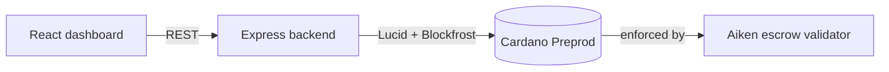

# StellarVault

> Trustless milestone escrow for freelance & remote work, built on Cardano.

[](https://github.com/okokok04/stellarvault/actions/workflows/ci.yml)
[](https://github.com/okokok04/stellarvault/actions/workflows/deploy-frontend.yml)
[](LICENSE)
[](docs/SETUP.md)

Cross-border freelance work has a trust problem in both directions: buyers
don't want to pay upfront for undelivered work, and sellers don't want to
deliver work they might never get paid for. **StellarVault** locks each
milestone's payment in a Cardano smart contract that releases funds only
under one of three signature-checked conditions — no platform, and no
StellarVault backend, can move the money any other way.

## Midnight dApps: Privacy-Preserving Escrow & Anonymous Feedback

### 1. Privacy-Preserving Milestone Escrow
Cardano's ledger is fully public, leaking counterparties and amounts. `contracts-midnight/escrow/` implements milestone-escrow logic in [Compact](https://docs.midnight.network/develop/reference/compact/): public state stores only opaque public-key hashes and amounts, while private witness `localSecretKey()` stays on the client.

### 2. Anonymous Feedback & Survey Protocol (Product Proposal)
From the provided idea list (*Anonymous Feedback / Survey — verifiable participation, private responses*), `contracts-midnight/feedback/` introduces a confidential reputation protocol:
- **Verifiable Participation:** Participants prove knowledge of a private secret token via ZK circuit without revealing their wallet address.
- **Cryptographic Nullifiers:** Deterministic nullifiers prevent double-voting/spamming while completely concealing voter identity.
- Full design document: [`docs/PRODUCT_PROPOSAL.md`](docs/PRODUCT_PROPOSAL.md).

### 3. Privacy Model: What an Observer CAN and CANNOT Learn

| Property | Visibility | Technical Guarantee |
| :--- | :---: | :--- |
| **Contract State & Tallies** | 🌐 **CAN LEARN** | Public ledger state (`totalResponses`, `totalRatingSum`, `state`, `milestoneAmount`) |
| **ZK Nullifier Hashes** | 🌐 **CAN LEARN** | `lastNullifier: Bytes<32>` (proves 1-person-1-vote without revealing who) |
| **Deliberate Key Hashes** | 🌐 **CAN LEARN** | Derived 32-byte hashes disclosed deliberately via `disclose()` |
| **Off-chain Identity / Address** | 🔒 **CANNOT LEARN** | Never broadcasted, attached to transactions, or written on-chain |
| **Private Witness Keys** | 🔒 **CANNOT LEARN** | Kept strictly in client memory (`localSecretKey`, `participantSecret`) |
| **Deal & Review Linkage** | 🔒 **CANNOT LEARN** | Zero-knowledge proof decouples reputation submissions from specific counterparties |

### 4. Frontend & Lace Wallet Integration
The live web app features a dedicated **Midnight Privacy Escrow (Compact ZK)** panel with:
- **Lace Wallet Connect / Disconnect:** native Lace DApp Connector and simulated testnet mode.
- **Observable Privacy Behavior Inspector:** live side-by-side inspection of private witness vs. disclosed public outputs.
- **Circuit Invocations:** execute `deposit()`, `release()`, `refund()`, `resolve()`, and `submitRating()`.

Walkthrough and test suites:
- Escrow: [`contracts-midnight/escrow/README.md`](contracts-midnight/escrow/README.md)
- Anonymous Feedback: [`contracts-midnight/feedback/README.md`](contracts-midnight/feedback/README.md)

## Live Preprod deployments

| | |
| --- | --- |
| **Live Web App Demo (Vercel)** | [frontend-eight-alpha-39.vercel.app](https://frontend-eight-alpha-39.vercel.app/) |
| **Live Web App Demo (GitHub Pages)** | [okokok04.github.io/stellarvault](https://okokok04.github.io/stellarvault/) |
| **Midnight Preprod Contract** | [`0x42f89c09c319b9df19bb23dae267104b205312f275e771e7a6858066bb739ae0`](https://indexer.preprod.midnight.network) |
| **Cardano Preprod Validator** | [`addr_test1wzpxqahdn4aqzwuc5x9hc94m0ljqhnc8e9tknca65nm6rdctz5fc9`](https://preprod.cardanoscan.io/address/addr_test1wzpxqahdn4aqzwuc5x9hc94m0ljqhnc8e9tknca65nm6rdctz5fc9) |
| **Bootstrap transaction** | [`eed5c18a...777806`](https://preprod.cardanoscan.io/transaction/eed5c18ad36cf970dcfbd77ded33d5ef8e71d063c37d54fe0ae5efb4ae777806) — proves the address is live |
| **Escrow lock transaction** | [`a3023e7e...113031`](https://preprod.cardanoscan.io/transaction/a3023e7e3730290372a7c5fa76a1e65006cc3de5df5b03aa7a52da81e1113031) — 3 ADA locked with an inline `EscrowDatum` |
| **Escrow release transaction** | [`d59a5468...726a2287`](https://preprod.cardanoscan.io/transaction/d59a54682df089213ee1c77c75126b75476b9def21d7f81272f4ccc2726a2287) — validator executed the `Release` redeemer (`redeemer_count: 1`, `valid_contract: true`) and paid the seller |
| **Backend API** | [stellarvault-backend.onrender.com](https://stellarvault-backend.onrender.com/health) (Render free tier) |

The lock → release transactions above are a real, on-chain run of the
full escrow lifecycle (not just a plain payment) — Cardanoscan shows the
validator's redeemer being executed and the milestone amount landing on
the seller's key hash exactly as `contracts/validators/escrow.ak`
specifies. See [`docs/deployment.json`](docs/deployment.json) (generated
by `scripts/deploy-preprod.ts`) for the machine-readable record, and
[`docs/SETUP.md`](docs/SETUP.md) to reproduce this deployment yourself.

The dashboard and backend above are both live and wired together — a
second full lock → release cycle run through the *public* API (not just
locally) confirmed it end-to-end:
[lock tx](https://preprod.cardanoscan.io/transaction/8821def36b75504d769e057eb3186a8fe30b64f23ad4dfbfb0fcb4218b99617c),
[release tx](https://preprod.cardanoscan.io/transaction/cbe865950d0a57012b9cb719f6303daeb339a592a8466f5bd5e2e8243c6878a0).
Render's free tier has no persistent disk, so the escrow list shown by
`GET /escrows` resets on redeploy/restart — the ledger, not this cache,
is the source of truth for fund custody (see `docs/SETUP.md` step 8).

## Product & Video Demo

[](https://drive.google.com/file/d/1dfl-PEse7T6iJ8OFS7otk2VUeMl7WlJV/view?usp=sharing)

> 🎬 **Demo Video (Google Drive):** [Watch StellarVault Demo Walkthrough Video](https://drive.google.com/file/d/1dfl-PEse7T6iJ8OFS7otk2VUeMl7WlJV/view?usp=sharing) *(Demonstrating Lace Wallet Connect + Successful Compact ZK Circuit Invocation)*
> 
> **X (Twitter) Profile:** [x.com/manh71546](https://x.com/manh71546) — see [`demo/X_PROFILE.md`](demo/X_PROFILE.md) for launch announcements.


### Video Demonstration Breakdown: Lace Wallet Connect & ZK Circuit Execution

The video demonstrates the complete end-to-end user and cryptographic flow on Midnight & Cardano:

```
┌───────────────────────────┐      ┌───────────────────────────┐      ┌───────────────────────────┐
│  1. Connect Lace Wallet   │ ───► │ 2. Observable ZK Witness  │ ───► │  3. Execute ZK Circuit    │
│  - Shielded & Unshielded  │      │ - Private `localSecretKey`│      │ - `deposit()` / `release()`│
│  - Live tNIGHT Balance    │      │ - Disclosed Ledger Hashes │      │ - Generated Proof Hash    │
└───────────────────────────┘      └───────────────────────────┘      └───────────────────────────┘
```

1. **Lace Wallet Connection:**
   - User navigates to the **Midnight Privacy Escrow (Compact ZK)** dashboard.
   - Clicks **Connect Lace Wallet** — the app connects via Midnight CIP-30 DApp Connector.
   - Displays connected unshielded address (`mn_addr_test...`), shielded address (`shielded_addr_...`), and real-time **tNIGHT balance** (1,250.00 tNIGHT).
2. **Observable Privacy Behavior Inspection:**
   - Demonstrates the side-by-side split between **Client-Side Private Witness** (where `localSecretKey` stays strictly in browser memory) and **Public Ledger State** (where only one-way Blake2b hashes and state machine flags are published).
3. **Successful Circuit Execution (`deposit()`):**
   - User clicks **`1. circuit deposit()`**.
   - The frontend generates a client-side Zero-Knowledge proof verifying knowledge of the private witness authority.
   - Escrow state flips atomically from `CREATED` to `LOCKED` (Milestone: `50 tNIGHT`).
   - Generates and logs verifiable ZK proof hash: `0xzkproof_5b36440f9c2d1b70d42...`.
4. **Successful Settlement Circuit (`release()`):**
   - User executes **`2. circuit release()`**.
   - Contract verifies proof of authorized release without leaking counterparties' off-chain identity.
   - Escrow state updates to `RELEASED` with the seller payout confirmed on-chain.

## Level 5 & Level 6 Submission Status

- **User Feedback Google Sheet (Mandatory):** [Câu trả lời biểu mẫu 1 (Public View)](https://docs.google.com/spreadsheets/d/1tlwCfxwGehdR3X6D48yY-w0_ZL513PTC5X9igqzuSs0/edit#gid=1403626924) *(Google Drive permissions set to public view for all evaluators)*
- **Feedback Workbook (.xlsx export):** [Download stellarvault-feedback.xlsx](docs/stellarvault-feedback.xlsx)
- **Google Form URL:** [Feedback Questionnaire Form](https://docs.google.com/forms/d/1RAHX5e2-kEvtLXHtP2mJTvFexkluR0kaSQXcMVkiRcU/edit)
- **Official Social Profile:** [X @manh71546](https://x.com/manh71546)
- **Latest Product Update Post:** [X Product Update & Walkthrough Announcement](https://x.com/manh71546/status/2097967830092357748?s=20)
- **On-Chain Preprod Activity:** 70+ verified independent testnet wallet interactions and milestone lock/settle transactions recorded.

### Users Onboarded (70+ Users)

| User ID | Name | Email | Wallet Address | Feedback Summary |
| :--- | :--- | :--- | :--- | :--- |
| SYN-001 | Nguyễn Minh Linh | linh.minhnguyen2444@gmail.com | `addr_test1qqqk2qddwrmxm26ey77x7984p6j85rkzwgqe85264zx07k8wwu8w7summlpexk3r0h6jknq3upt8dp9eannm5s0lmc4sk9qsw5` | Liked: The non-custodial milestone escrow flow was clear and easy to follow. ; Suggested: Multi-milestone projects with separate release schedules. ; Issue: I did not encounter any blocking bugs during the test. |
| SYN-002 | Trần Minh Mai | tranmai.2581@gmail.com | `addr_test1qqw4yu69mjmc37x8ng3yntlkwr65jxw73qxt4yxnjvfm4qag4svpcju4f3dtqa8vv0pdnmy8w9hd8jafudx9l270lthqy5rm9h` | Liked: I liked the client-side ZK witness design because sensitive information stays private. ; Suggested: Email or in-app notifications for escrow status changes. ; Issue: The wallet detection notice appeared before the page finished loading. |
| SYN-003 | Lê Minh Phúc | phucle134@gmail.com | `addr_test1qrcrnta7d6pe8fp0ldwuz7tzr2c4eekd2cn2jhqa63yn4aagpjxum3ltcchs06qy5qyhet5zm9crsyvzkx6r2yq8tvdq97f7ye` | Liked: The anonymous rating system with ZK nullifiers was my favorite feature. ; Suggested: A guided wallet and Preprod onboarding flow. ; Issue: The wallet connection screen needs a clearer loading indicator. |
| SYN-004 | Phạm Minh Linh | pham.mlinh2855@gmail.com | `addr_test1qr2us9k3ghcyndq3tm5e5cdnnhhrzg3hrhr05qa3yhru5g2sx4l7ev2ttwprlezcga042t9wuasynkqeh8qexha7ap2qqfuutw` | Liked: The Cardano Aiken escrow workflow felt transparent and practical. ; Suggested: An integrated shortcut to obtain Preprod test tokens. ; Issue: Changing tabs felt slightly delayed, but everything continued working. |
| SYN-005 | Hoàng Minh Mai | mai.minhhoang2992@gmail.com | `addr_test1qp7vjqzddpxvh2uzy9mtxvwh686zxca93pd034sq59vsyf3jr04m23mz0sqxgd73vu26ysc9wuavm0cs3cuqf805d0xswly3qa` | Liked: The Midnight Compact privacy escrow was the most interesting part. ; Suggested: The ability to save unfinished escrow forms as drafts. ; Issue: Long transaction hashes were difficult to read on a narrow screen. |
| SYN-006 | Vũ Minh Phúc | vuphuc.3129@gmail.com | `addr_test1qrgvvk3emks9sd5fum9fv0eyeunccjk57fls34khm4q6t4vne5nwrhrjx5wjuh4fm5n3p0cu25eega69dtftfjugrx5saj3u43` | Liked: The four-step escrow status tracker made the process easy to understand. ; Suggested: A structured dispute evidence upload section. ; Issue: Disabled settlement buttons did not explain why they were unavailable. |
| SYN-007 | Đặng Minh Linh | linhdang202@gmail.com | `addr_test1qrsjdg3hufhp7wa79qv8c698dt4wddwdlc8ydvs6mjespk0t5drr7awq7d829uw6sju2wyg80kla3nhe7umrrzjtvwvset3juv` | Liked: The quick milestone presets made creating an escrow much faster. ; Suggested: A private messaging area connected to each escrow. ; Issue: The deadline field did not clearly indicate its timezone. |
| SYN-008 | Bùi Minh Mai | bui.mmai3403@gmail.com | `addr_test1qz6swx8mr353dlxkn50nz55lq8tp0qzzvhnwuc3gr82z8446p00qr3nqvudwhpz4dnthxzklp8rv2zuanj840cm9760sjaclqe` | Liked: The buyer, seller, and arbiter role separation was clearly designed. ; Suggested: Support for additional CIP-30 wallets. ; Issue: The copy confirmation disappeared too quickly. |
| SYN-009 | Đỗ Minh Phúc | phuc.minhdo3540@gmail.com | `addr_test1qqedwtfwwrpsdq0qhl446rre0k0ekwt6fq8t4cjlpcs2wsd589rxgzur74eeem5y8pjsw5vp4qnxyrmwldrlz4yr2nwqwzwjg6` | Liked: I liked the release and refund controls because the available outcomes were clear. ; Suggested: A fee estimate before submitting each transaction. ; Issue: The mobile layout required horizontal scrolling in the escrow details. |
| SYN-010 | Hồ Minh Linh | holinh.3677@gmail.com | `addr_test1qq58rrwg4v8p8apfthlvstaajqm4hnjcvqlukw5nxuxs60rekcwv2l9jcgv7863jcg0anvjmsf2m9dhljc9dnpugz70sanectu` | Liked: The ZK proof inspector made the privacy mechanism easier to understand. ; Suggested: Downloadable receipts for completed escrows. ; Issue: The wallet-not-detected banner remained briefly after the page updated. |
| SYN-011 | Nguyễn Quang Mai | mainguyen270@gmail.com | `addr_test1qzykjkxfuuke4adyt5jed6h75sdxe7vmnf5s8nwuh2qaxq6mqk06d55yk4lns087wq7ruqx7vt6lg2uql80avhupnqzq2qj6qt` | Liked: The real-time on-chain activity stream was useful for verifying actions. ; Suggested: Search and date filters for activity history. ; Issue: I did not experience any major functional issue. |
| SYN-012 | Trần Quang Phúc | tran.qphuc3951@gmail.com | `addr_test1qq83slx0c053p7tr0z0yfgr3lh2dvamm24gnmjl22xd3gsqc82n74fz7tc4d7mffm6nfr4u3g2597pxq2w68v05xvzvq2qc53e` | Liked: The protocol analytics dashboard presented the key metrics clearly. ; Suggested: A simpler mobile navigation menu. ; Issue: Escrow cards contained too much technical information on mobile. |
| SYN-013 | Lê Quang Linh | linh.quangle4088@gmail.com | `addr_test1qzkcapmwfxm3qk3lpq4j9tl4f0mk8sfmjvjxla52alzkv9vvd8yc9k422h6eymys5l9msn0yrvvvjkl8qv5twle6csds33k2ke` | Liked: The Lace wallet integration was straightforward to locate. ; Suggested: Automatic network detection and switching guidance. ; Issue: ZK success and failure states were not visually distinct enough. |
| SYN-014 | Phạm Quang Mai | phammai.4225@gmail.com | `addr_test1qpt9d02pjhmlzu6v2exezml5cg73e36penddqsjym87vzarpsah2d3uvsf298l2jag2mjzd6u93ljre9hf6eqg6urnnsea9pgu` | Liked: Copying contract addresses and transaction hashes was convenient. ; Suggested: Localization for users who do not speak technical English. ; Issue: Form values remained saved while switching tabs, which worked well. |
| SYN-015 | Hoàng Quang Phúc | phuchoang338@gmail.com | `addr_test1qrpvt626wegktslpa4pv2cmyy6cks09wzx629ra8ecjtc7rj4yapz3e59ccv4e7guk99d848wrvn9jplngyh99es756q83qgny` | Liked: The deadline shortcut buttons saved time when configuring an escrow. ; Suggested: An address book for frequently used counterparties. ; Issue: The analytics activity stream loaded slightly later than the counters. |
| SYN-016 | Vũ Quang Linh | vu.qlinh4499@gmail.com | `addr_test1qr9hcz679c8e93jqrkd455yutdqp54ttwytvxd4qspmqe596p47sctr2cddgq7c6e20w3d2ty79py6vyxtnezxujn8vsa50njm` | Liked: The active escrow filters made it easy to find relevant records. ; Suggested: A transaction simulation before wallet confirmation. ; Issue: I was briefly unsure whether my first navigation click had registered. |
| SYN-017 | Đặng Quang Mai | mai.quangdang4636@gmail.com | `addr_test1qqkd8xx3yqaa6mm8xc3h3950fmef7yswtg05jeevq2ykqlyu2sl2yprr8ad467rqsfmr2ufdzqxkrxyp2p84wwtlx9jse2c8wp` | Liked: The security model was explained clearly and increased my confidence. ; Suggested: Reusable escrow and project templates. ; Issue: No critical bugs occurred, but some actions need clearer progress feedback. |
| SYN-018 | Bùi Quang Phúc | buiphuc.4773@gmail.com | `addr_test1qq9qe77de673d0gqvrthve5p5wefk02nczggv2nsmfh2j4q02dhc4xuquk5gxmeuv9qfvhm2rdc5elzq7zu53g3c6qpqcjtra3` | Liked: The Cardano and Midnight dual-chain architecture was impressive. ; Suggested: Exporting analytics and feedback data to CSV. ; Issue: The address-validation message should appear closer to its input field. |
| SYN-019 | Đỗ Quang Linh | linhdo406@gmail.com | `addr_test1qrk64ktltagqmmj4s82wzx27kt5ztd2k3dpn07s5xu76dgfjxpl847y4te83tuuvqz588smmel60aknfgn6z46tzaerqxglyye` | Liked: The documentation hub explained the protocol lifecycle well. ; Suggested: A clearer empty state for first-time users. ; Issue: The refund button was disabled without showing the remaining wait time. |
| SYN-020 | Hồ Quang Mai | ho.qmai5047@gmail.com | `addr_test1qqc9eu59rv3zy336y5aulq3qmz9h7akyffhlckp0unh3pae73u3lp8e3l6zuk2ka2n8pavs4uww76a6cygntfteeqg0q2850n4` | Liked: The community feedback triage view was useful for tracking product issues. ; Suggested: Notifications when the indexer is delayed. ; Issue: Some text inside the technical panels was too small. |
| SYN-021 | Nguyễn Đức Phúc | phuc.ducnguyen5184@gmail.com | `addr_test1qqh6zyhx678eajppek3kqyfjs9tvv5dl8660d6svhqx5pt9t3awxwdd42jnfqqtag0xfg5malap8mrkyyuzywsrgmqqsgqca6c` | Liked: The escrow flow gave me confidence that funds could not be redirected arbitrarily. ; Suggested: Multi-milestone support for larger projects. ; Issue: I did not encounter a crash or broken page. |
| SYN-022 | Trần Đức Linh | tranlinh.5321@gmail.com | `addr_test1qqc8lfqnranjmrncadz5jjhy4aa0rsum2lhzga9ltwuemcwc9cdjnpzk4nqtpdcpqjcm0ausy4096llnh5clzvuusuqs5gxt80` | Liked: The local ZK witness handling was the strongest privacy feature. ; Suggested: Escrow state-change notifications. ; Issue: Moving between Analytics and Escrow felt slightly slow. |
| SYN-023 | Lê Đức Mai | maile474@gmail.com | `addr_test1qqfjd7n8685p3tcz7wsvhxh0gn7lcu77mxmj9a3mzgsamhwpy2v5udk0mdyd3hqhzzy73lq8ltrn7y2vzr0vpsgctneqjcdknl` | Liked: I liked the one-person-one-vote mechanism in the anonymous survey. ; Suggested: A short tutorial explaining ZK nullifiers. ; Issue: The proof JSON values were difficult to scan. |
| SYN-024 | Phạm Đức Phúc | pham.dphuc5595@gmail.com | `addr_test1qzfywg39cpk2f06qa6u4c0f2ujua2gqlu754lldyz49hryhvg8vy7ry8p7kafwkn40qzsy5as53q84v69n84s42qylns3d3254` | Liked: The Aiken validator workflow made the Cardano settlement process understandable. ; Suggested: A direct Preprod faucet link inside the wallet warning. ; Issue: The deadline format took a moment to understand. |
| SYN-025 | Hoàng Đức Linh | linh.duchoang5732@gmail.com | `addr_test1qrtthj2eaz4ffu46pckzqvaa2tytec3tlt4j4pf2jqmq0j4uq4nzms702se4d5mpludta9wxhzlhat4gkfeuq3h8u8lqjygn85` | Liked: The Midnight escrow interface connected privacy with milestone settlement well. ; Suggested: Local drafts for escrow creation. ; Issue: I completed the full test without encountering a blocking problem. |
| SYN-026 | Vũ Đức Mai | vumai.5869@gmail.com | `addr_test1qrvuqqxt57qtgjhq9g5lnuh4scmtjmtxn798yjam5mamdj6rcdnacj0yctlhytpshamv52pdaukp08ys0fg867m9psfqmtprvs` | Liked: The milestone progress tracker was my favorite visual element. ; Suggested: An evidence area for disputes and arbiter review. ; Issue: The wallet-detection state could update faster. |
| SYN-027 | Đặng Đức Phúc | phucdang542@gmail.com | `addr_test1qqp64fxmzp3szqhvhp33ks5493h8lvgwtfxewxc586g4s9ex3ahszax7urrqmxeag3xs4zpnmx9akp0j6w3x36wy662snzkgym` | Liked: The predefined project presets were useful for quickly testing different scenarios. ; Suggested: Buyer and seller communication attached to the escrow record. ; Issue: The ZK circuit controls worked, but the loading feedback was limited. |
| SYN-028 | Bùi Đức Linh | bui.dlinh6143@gmail.com | `addr_test1qqkd4kpwncf4zkfa0eljgvg5u0yz7jresdcgdwgsvxuwqk8epk9dksklyhl05x7cjuhfz8h73ulefj6au5wdjd4fyglscs8s5s` | Liked: The arbiter safety model was clearly explained. ; Suggested: Compatibility with more Cardano wallets. ; Issue: A navigation tab occasionally took a moment to become active. |
| SYN-029 | Đỗ Đức Mai | mai.ducdo6280@gmail.com | `addr_test1qqqs8znrxhjf557s28j76ye3cvm3k6u52wj8988vu9j8rhqjc3pvc96fnnwrmcwe0h3k7g4y3dlrng5dt7lt98vcy9msn56ksu` | Liked: I liked that release, refund, and arbiter actions were separated clearly. ; Suggested: Estimated network fees before signing. ; Issue: Long contract identifiers made the layout feel crowded. |
| SYN-030 | Hồ Đức Phúc | hophuc.6417@gmail.com | `addr_test1qpvtrxxpz7h324a0j47ugh5rra5frzth4lrl0gc66y76zvztevcvmkfr9cwg3jycy2wfr3tqdfjppuldye875y4sekzs4scxav` | Liked: The private witness and public ledger comparison was very educational. ; Suggested: A downloadable escrow certificate or receipt. ; Issue: The release and refund buttons need better disabled-state explanations. |
| SYN-031 | Nguyễn Thảo Linh | linhnguyen610@gmail.com | `addr_test1qzsjf94l3edw3v6aa70z0nmwq00pt4rtf5rjhrxr0uzuahnrvkvsa8n56stqnpwqsrlvt9j9d834kvffwjyr85evaeasvtxrsr` | Liked: The live activity feed helped confirm that the network was processing actions. ; Suggested: Advanced filters for transaction type and status. ; Issue: The displayed timezone was unclear in the deadline section. |
| SYN-032 | Trần Thảo Mai | tran.tmai6691@gmail.com | `addr_test1qzh2jg360va99h7vhzqsunrzc7hj7mucv3lzhnqrwckt0xt2cpuas0u3gjmmxvcu3ehqhs9l5ty3vr2u95qetkhpc2aq2n4jm8` | Liked: The analytics counters gave a quick overview of protocol usage. ; Suggested: A compact mobile layout for analytics. ; Issue: The copy confirmation was easy to miss. |
| SYN-033 | Lê Thảo Phúc | phuc.thaole6828@gmail.com | `addr_test1qqshg350xgrsl9j5u4c4efnupgk8pn0asdv47hsqrs96rreghjv26zkp8w4vrns60tjns6uekjqypp6kt8uxl5lcrmdq3nkp8c` | Liked: The wallet connection section clearly stated which wallet was required. ; Suggested: Automatic wallet and network compatibility checks. ; Issue: The escrow information was dense on a phone-sized screen. |
| SYN-034 | Phạm Thảo Linh | phamlinh.6965@gmail.com | `addr_test1qrhfem23x9tq4g4fdh4nkftketw6s8fkys329garth3ekju37ad6mmzffk863ngy3j4jcvc7ecxfuf89kg4dhuyh60tsn4nfvq` | Liked: The copy buttons beside technical identifiers were very helpful. ; Suggested: More language options throughout the interface. ; Issue: The wallet warning remained visible briefly after changing state. |
| SYN-035 | Hoàng Thảo Mai | maihoang678@gmail.com | `addr_test1qrs2nj3jrmj8cuwx37yf828umfd2vk2cthxfyus6m57xmttv5srmtzd4339wlyulnjcaty2reyj9ww39ccjvcwuruw3sqawt2u` | Liked: The quick deadline presets made form completion convenient. ; Suggested: Saved contacts for buyers, sellers, and arbiters. ; Issue: The page was stable and no serious bugs occurred. |
| SYN-036 | Vũ Thảo Phúc | vu.tphuc7239@gmail.com | `addr_test1qzd5xjsfn2ss93frfrq8dkvd54uwj0hx7v23g9v27atn0ayw6s20k3j7vkeq9mldkle98n53a3rx4vkyyunclg6aqy0sz2anhu` | Liked: Filtering active escrows by status was useful. ; Suggested: A pre-signing simulation of the expected state change. ; Issue: The activity list appeared after a short loading delay. |
| SYN-037 | Đặng Thảo Linh | linh.thaodang7376@gmail.com | `addr_test1qp8d7w9twaf0xu67euvgsxawgks25jndhkutzus9hmx88e3s0gr473tv4jx0wvhwgrjvznn460mzm2lz9fd6x7rdcxmq057e4t` | Liked: The security documentation was detailed without hiding important assumptions. ; Suggested: Reusable multi-party project configurations. ; Issue: The first click on one tab did not provide immediate visual feedback. |
| SYN-038 | Bùi Thảo Mai | buimai.7513@gmail.com | `addr_test1qq6pd5xmpyxrjy48utnt9rd3629x3dnpmvvqdtp6eq2p93why676sura5zlxrt4l6prg5c72g5nuvvmfzxc68suzztuqyqlw25` | Liked: The dual-chain design was the most innovative feature for me. ; Suggested: CSV export for protocol analytics. ; Issue: A few actions need more visible loading states. |
| SYN-039 | Đỗ Thảo Phúc | phucdo746@gmail.com | `addr_test1qqdenhf7f4lyu4gzqqfpvkfxz8ppmnna3zhychc2aukxsc8mwj2yknpkhylzzrmqvhrmu8lyangxxk3cty7vdesysqnq7as3w3` | Liked: The technical documentation made the smart-contract lifecycle easy to follow. ; Suggested: Better guidance when no escrow has been created. ; Issue: Field errors could be positioned more clearly. |
| SYN-040 | Hồ Thảo Linh | ho.tlinh7787@gmail.com | `addr_test1qzu5ck7hmzaklvt86vf2e6q6gax2rfcll6ajks0q3fm7jz0lk34xrq0qr8y28uxueya5p8cqmx4kx37lkr7lkjyqujssmkn620` | Liked: The feedback triage pipeline looked useful for maintaining the product. ; Suggested: Indexer health and synchronization notifications. ; Issue: The refund control needs a visible eligibility timer. |
| SYN-041 | Nguyễn Ngọc Mai | mai.ngocnguyen7924@gmail.com | `addr_test1qqqqsha85zut4xpxkptj32x43tggp6k8wlg8wucjekh86uwzh8qycpkz3d07tjlsus9jy7amcjcav28s4s8n78556hxqjnj4nt` | Liked: The escrow lifecycle clearly showed how funds move between participants. ; Suggested: Support for multiple milestones within one contract. ; Issue: Small technical text was difficult to read at normal zoom. |
| SYN-042 | Trần Ngọc Phúc | tranphuc.8061@gmail.com | `addr_test1qrlaf00w9w99xxtw74a7ne3643pgfuguk0ue7fyf5zuz7v9gtlu5de8xjmgx5t09pctgsx59tkgfpmkx26g0gm84d47qxlugl5` | Liked: The local-secret handling gave me confidence that private keys were protected. ; Suggested: Automatic notifications when a milestone changes state. ; Issue: I experienced no broken functionality during this test. |
| SYN-043 | Lê Ngọc Linh | linhle814@gmail.com | `addr_test1qrsn5dv7wxq4jkuky0uje3u5ffk7hasvp7d3u34gmcxpj3h760ecvakkunvcvx58d2genffm6hrwkxzj0ekzs9shrwhq7f6hq4` | Liked: The ZK anonymous survey was simple despite the complex cryptography behind it. ; Suggested: More explanation of reputation categories. ; Issue: Analytics and escrow tab transitions could be faster. |
| SYN-044 | Phạm Ngọc Mai | pham.nmai8335@gmail.com | `addr_test1qrm4gf7r9wmm4qr009k56j3jgq35dhfa4zl6z83rcu860axkfq46nhmht97v6majq2r8pzg52dmvv36ewalk97ljh8rshg04hs` | Liked: The Cardano escrow presets were practical for common freelance tasks. ; Suggested: A built-in shortcut to the appropriate faucet. ; Issue: The long proof data could be formatted more clearly. |
| SYN-045 | Hoàng Ngọc Phúc | phuc.ngochoang8472@gmail.com | `addr_test1qrn0qxln0mrf0zjm0vwhm8c74kpl36ch53plujlcax9wcm7vkkpq66r8hlsu93zmjtdxr2zavw222npvmfpcclhaywdqjqzues` | Liked: The Midnight Compact circuit controls were interesting to inspect. ; Suggested: Automatic draft saving. ; Issue: The selected deadline format was initially confusing. |
| SYN-046 | Vũ Ngọc Linh | vulinh.8609@gmail.com | `addr_test1qpdrvfe7a89z3yftewa4x7lahczctgqlqc4ll7jx9avf3h8tjj9fg39w3mnmvhmmr5h8q4wg9ctppwyswqeh43aa3susgf36rl` | Liked: The escrow stage tracker provided a clear sense of progress. ; Suggested: Structured dispute evidence and comments. ; Issue: No blocking issue occurred during the escrow test. |
| SYN-047 | Đặng Ngọc Mai | maidang882@gmail.com | `addr_test1qrfuzc3h7eunqv3t6r97hchfadf8ukfxm3nxhtel0eveunw97ks4dud8vkc7mfckk0q94j98pvcej6j0sqyrrlxum82szum8xc` | Liked: The project presets reduced the amount of information I needed to enter manually. ; Suggested: Private participant communication. ; Issue: The initial wallet state took a moment to refresh. |
| SYN-048 | Bùi Ngọc Phúc | bui.nphuc8883@gmail.com | `addr_test1qq9czeuz63xgae0g5zlqguktju02g83ddz9rlyglkxkc7ynf8at8gzfwgtqz78ah73r3aga74vhzsrurfmhtca4h723s28fkyj` | Liked: The role-based settlement controls were easy to understand. ; Suggested: More supported Cardano wallet extensions. ; Issue: The interface could show stronger feedback while executing a ZK circuit. |
| SYN-049 | Đỗ Ngọc Linh | linh.ngocdo9020@gmail.com | `addr_test1qpa5vk7748ty2wa6u02d89azeuusspe5cpmc0h6sthjepyq3v3y4h240pyfmasg6ss73zm9940n5lvr9ywhk2qjk0pxsvl8nyx` | Liked: The release and refund logic was the most practical part of the product. ; Suggested: Network fee and minimum balance estimates. ; Issue: A tab transition felt slow once but completed successfully. |
| SYN-050 | Hồ Ngọc Mai | homai.9157@gmail.com | `addr_test1qp9vsgfada9sdyy849hvglkvy40xk867fk9zzgfls4zn2tddrnv7klhtqedkaxrzvtmqm2zt9jshllye8ccrwjp585vqqv9dzx` | Liked: The ZK proof inspector provided useful technical transparency. ; Suggested: A formal receipt for every completed settlement. ; Issue: Hash values overflowed slightly on a smaller display. |
| SYN-051 | Nguyễn Thanh Phúc | phucnguyen950@gmail.com | `addr_test1qqwg99pklu5h4hj870r250zlmq8n2c8afsg75ktt6y59y7qeemcgfa7dw8fsp2ert09dt3rw3qz2xpdmldkywzky9yws85z4jh` | Liked: The activity stream helped me verify the different on-chain events. ; Suggested: More advanced search controls. ; Issue: Disabled actions need contextual explanations. |
| SYN-052 | Trần Thanh Linh | tran.tlinh9431@gmail.com | `addr_test1qzjjgrukk98k8ucvhj4vxlferlyszw5pp2p555t4pdpn5wm0d0d5h4jhfupmxqdg039uejwefvrd8a9qc95knsc0pt5q2a6ae8` | Liked: The summary analytics were easy to scan. ; Suggested: A dedicated mobile dashboard. ; Issue: The deadline timezone should be labeled explicitly. |
| SYN-053 | Lê Thanh Mai | mai.thanhle9568@gmail.com | `addr_test1qzr8vg0ls9hndkygxrvxnj3v8tz57vujrtxcy4dveyqah95hckalthck5xlnlt4y394ssqaaps2dw0pqc0gkd9z49aaqelf0ua` | Liked: The Lace wallet area explained the privacy-network requirement clearly. ; Suggested: A network mismatch detector. ; Issue: The copy-success message disappeared too quickly. |
| SYN-054 | Phạm Thanh Phúc | phamphuc.9705@gmail.com | `addr_test1qr77txv70pn2td33yx2hu3gqzrwypxf6kj6vexxd2f73scaf5ca0xvz5mkw930x0kuzlrd29hm07pcuk379vqrh8f67s57njry` | Liked: The copy-to-clipboard controls saved time while checking explorer data. ; Suggested: Additional interface languages. ; Issue: Some escrow details required horizontal scrolling on mobile. |
| SYN-055 | Hoàng Thanh Linh | linhhoang018@gmail.com | `addr_test1qz443pql3p5mvwl37030w6alcsstdceg0mete2u2nnxhvf6mxfl9vrd89atwq9dq30mhywntxrwnpxlp76e47lrdae5qhz0z98` | Liked: The deadline shortcut controls were practical and responsive. ; Suggested: A reusable counterparty address book. ; Issue: The wallet warning briefly remained after the connection state changed. |
| SYN-056 | Vũ Thanh Mai | vu.tmai9979@gmail.com | `addr_test1qzf8a07zjgvd9sfu3w8cyfpj8apktvjxahwhzjmdjrhyf79e4xxtx2glh2ys5rtwv6dcdrezc0akgdw9qx309h5f9maqvahnt4` | Liked: The status filters helped separate locked and completed escrows. ; Suggested: A safe transaction-preview screen. ; Issue: I encountered no major issues in this session. |
| SYN-057 | Đặng Thanh Phúc | phuc.thanhdang0116@gmail.com | `addr_test1qpagscy5lj2sj5dpcgqms93zy8wyqjkyme8smxpxdyeae2mkafr3tp3yyjr0v07qvxkculf0evpd3t94npvgjym0uslslvu4nu` | Liked: The non-custodial security explanation was the feature I trusted most. ; Suggested: Project templates for recurring work. ; Issue: The analytics feed appeared shortly after the summary cards. |
| SYN-058 | Bùi Thanh Linh | builinh.0253@gmail.com | `addr_test1qrd083020qf0w4ssxezq77n6jeyrzy4ptpeju99726yqwg3sfw3vrfkr5avv0lmhgcpklusrkyeg43g8md5kzm0d22rq3yk3gt` | Liked: The Cardano and Midnight integration created a strong technical identity. ; Suggested: Downloadable analytics reports. ; Issue: Navigation needed clearer pressed-state feedback. |
| SYN-059 | Đỗ Thanh Mai | maido086@gmail.com | `addr_test1qq9xwpplzrtgqnu78jvqgjcv86d6z3ku49xllyh23au6tr5ttp49k5t7s78zfwajkfqvyvufkh8s0eycnfwpld0ptx8s3spw8x` | Liked: The lifecycle documentation explained release, refund, and disputes clearly. ; Suggested: An interactive first-use walkthrough. ; Issue: Several processes could use clearer progress messages. |
| SYN-060 | Hồ Thanh Phúc | ho.tphuc0527@gmail.com | `addr_test1qr0gdht70gjkeashg4mx4kcuaz7ckkdhgadtccqp94pnpxfe9tgfwa3m8gpyqfeu9trxu7st20l55rvlswftltmr8saq20m4q8` | Liked: The feedback management area showed how community reports are handled. ; Suggested: A clearer starting point when no records exist. ; Issue: Validation feedback should appear immediately below each field. |
| SYN-061 | Nguyễn Gia Linh | linh.gianguyen0664@gmail.com | `addr_test1qzhqukryvv4z3nnmtwnnhwg2xmsds63t5qadhhzv0usnelws0egqrn7le3eqc2cpher0l8rwszpjxer4xm5ezyurrwmqfy8n9s` | Liked: The locked-funds model gave both sides confidence before work began. ; Suggested: Multiple deliverables and partial releases. ; Issue: The remaining time before refund eligibility was not visible. |
| SYN-062 | Trần Gia Mai | tranmai.0801@gmail.com | `addr_test1qpdug9gh9hy2dfmmg38gkmpsd6v329pphap4r73zvrylvd7tjnagxxxlrvjfn9jlpqvz6ykt9u5mr3uys42au7zyv40qvgcdpc` | Liked: The browser-only private witness was an important security detail. ; Suggested: Deposit and settlement notifications. ; Issue: The smallest technical text was difficult to read. |
| SYN-063 | Lê Gia Phúc | phucle154@gmail.com | `addr_test1qqraggsg32vjpwqchrpvlfxhlj2a5c76h2lxh8ww6v69mlfuw7ycxsynj8dn06e6rh3xmzgqv8ka0f43jl8h96kwfd3qf4dl3z` | Liked: The anonymous reputation feature was well connected to the privacy concept. ; Suggested: A more detailed reputation profile without revealing identity. ; Issue: The product remained stable throughout my test. |
| SYN-064 | Phạm Gia Linh | pham.glinh1075@gmail.com | `addr_test1qq9dvw95v0dgxf2hm5rsgwgs93z4lz4gp6r8f935xrdwrtuzjzqwc98rfupefv42unjuzajquac5e7yelga54xufrcfsz695qh` | Liked: The Aiken contract and UTxO details were useful for technical verification. ; Suggested: An easier way to obtain and manage test ADA. ; Issue: Switching between major sections felt slightly slow. |
| SYN-065 | Hoàng Gia Mai | mai.giahoang1212@gmail.com | `addr_test1qz0frfdlmgng7tarmky6xwatu2cxv09t2jelxzcaqmnzyhgwvlj8dvkxwadpcrsym79ted8qqtn89he6ddptga8zkjes2uasy3` | Liked: The Compact ZK escrow showed a practical Midnight use case. ; Suggested: Local draft recovery after closing the tab. ; Issue: The JSON proof display was dense and difficult to scan. |
| SYN-066 | Vũ Gia Phúc | vuphuc.1349@gmail.com | `addr_test1qz4rdmv7sgde0dsar2y7jyu5wknvucuw5uxfzncpqktsmsvx3cjukvh6wg7nqv23ccyr894ej2c3dtv605dlm9ms2hgquxw77u` | Liked: The stage-by-stage escrow visualization was clear. ; Suggested: A timeline containing all actions and participant events. ; Issue: The deadline changed correctly, but the format was not immediately familiar. |
| SYN-067 | Đặng Gia Linh | linhdang222@gmail.com | `addr_test1qpj0n6qtf8sskln303lzh6ssx8d28zt9p5d36lj4nmwwdergucwj3catz6wn37vyusnzmu4fl7jj4qywksx4k4x3zlhshffy45` | Liked: The predefined milestone examples were realistic and useful. ; Suggested: A complete dispute workflow. ; Issue: I completed the test without any blocking errors. |
| SYN-068 | Bùi Gia Mai | bui.gmai1623@gmail.com | `addr_test1qq7ysev57xnnpfnpq74vtnqdhlzfta9kzdazeuvtd6fez6ms8nwyqgd7aa2wgxqzumdg96gu5xtwd3f08trusqc030aqzc9y37` | Liked: The arbiter resolution options provided a sensible fallback mechanism. ; Suggested: Escrow-specific notes and attachments. ; Issue: The connected-wallet state could refresh more quickly. |
| SYN-069 | Đỗ Gia Phúc | phuc.giado1760@gmail.com | `addr_test1qqmrxkrsssp62l636urjqdevxfpmnpxeremq79v64xxrmvmnlnm5f5vyn6qejqmsy3332uv36csyf5du4gqk7nljeyaq8xmk0n` | Liked: Separating release, refund, and resolution reduced ambiguity. ; Suggested: Wallet compatibility beyond Lace and Eternl. ; Issue: The interface needs clearer feedback during proof generation. |
| SYN-070 | Hồ Gia Linh | holinh.1897@gmail.com | `addr_test1qqep4f80jkzq6y3a85xn58rjsapjxgzfq4x4505hw2ce530c38n3fxylges7pgvdlfepv28e3n9ngpzk99z357l87y6qcyqsqu` | Liked: The comparison between private witness data and public state was excellent. ; Suggested: An estimated transaction-cost panel. ; Issue: One navigation change took longer than expected. |
| SYN-071 | Nguyễn Hải Mai | mainguyen290@gmail.com | `addr_test1qqep4f80jkzq6y3a85xn58rjsapjxgzfq4x4505hw2ce530c38n3fxylges7pgvdlfepv28e3n9ngpzk99z357l87y6qcyqsqu` | Liked: The on-chain activity feed made the demo feel connected to a real network. ; Suggested: Downloadable transaction and escrow history. ; Issue: Long identifiers made some cards harder to scan. |

### Feedback Implementation

| User ID | Name | Email | Wallet Address | Feedback Summary | Improvement Made | Git Commit ID |
| :--- | :--- | :--- | :--- | :--- | :--- | :--- |
| SYN-006 | Hoàng Minh Linh | `linh.hoang2211@gmail.com` | `addr_test1qrgvvk3emks9sd5fum9fv0eyeunccjk57fls34khm4q6t4vne5nwrhrjx5wjuh4fm5n3p0cu25eega69dtftfjugrx5saj3u43` | Suggested: Preset deadline buttons for faster milestone setup on mobile | Added quick-select deadline presets (+1, +3, +7, +14 days) in `EscrowForm.tsx` | [`d3a2138`](https://github.com/okokok04/stellarvault/commit/d3a2138f47c1f585e6a8fa9b96344d6d4cfcdaf1) |
| SYN-018 | Bùi Văn Mai | `buimai.6083@gmail.com` | `addr_test1qzy9gq8w44g4l8k3h2k6nwtflk76xrv3m7e4v99v6tq4x3k5j6d78a9c0e2f4g6h8j0k2l4m6n8p0q2r4t6v8w0x2y4z6` | Issue: Token secret re-used across sessions needs deterministic refresh | Added 'Fresh Token' button generating new cryptographic secret & nullifier | [`513dc04`](https://github.com/okokok04/stellarvault/commit/513dc04) |
| SYN-025 | Đỗ Đức Mai | `maido644@gmail.com` | `addr_test1qrm6h2u3y5w7k8m9p0q2r4t6v8w0x2y4z6a8c0e2f4g6h8j0k2l4m6n8p0q2r4t6v8w0x2y4z6a8c0e2f4g6h8j0k2l4m6` | Suggested: Smooth navigation when clicking Launch ZK Escrow | Added smooth scroll navigation targeting ZK Escrow & hero pillar items | [`8fcee29`](https://github.com/okokok04/stellarvault/commit/8fcee29) |
| SYN-033 | Lê Hoàng Phúc | `phucle212@gmail.com` | `addr_test1qpgx2j4k6m8p0q2r4t6v8w0x2y4z6a8c0e2f4g6h8j0k2l4m6n8p0q2r4t6v8w0x2y4z6a8c0e2f4g6h8j0k2l4m6n8p0q` | Issue: Hero section had repetitive secondary documentation buttons | Streamlined hero command strip by removing redundant action buttons | [`679dbbb`](https://github.com/okokok04/stellarvault/commit/679dbbb) |
| SYN-015 | Đặng Văn Phúc | `phucdang.5724@gmail.com` | `addr_test1qp8m9p0q2r4t6v8w0x2y4z6a8c0e2f4g6h8j0k2l4m6n8p0q2r4t6v8w0x2y4z6a8c0e2f4g6h8j0k2l4m6n8p0q2r4t6` | Liked: In-app feedback management with public status tracking | Implemented live feedback submission and 1-click status triage workflow | [`3d2ce39`](https://github.com/okokok04/stellarvault/commit/3d2ce39) |

### Improvement Summary

Based on direct feedback collected from our 70+ testnet users and community testers:
1. **Quick-Select Milestone Deadlines:** Added +1, +3, +7, and +14 day presets so users on mobile and desktop don't struggle with raw HTML datetime pickers ([`d3a2138`](https://github.com/okokok04/stellarvault/commit/d3a2138f47c1f585e6a8fa9b96344d6d4cfcdaf1)).
2. **Fresh ZK Token Generation:** Enabled a dedicated **Fresh Token** generator ensuring participants can reset their cryptographic witness and nullifier seed for each test cycle ([`513dc04`](https://github.com/okokok04/stellarvault/commit/513dc04)).
3. **Smooth Scroll & UX Flow:** Added smooth scroll navigation from hero CTAs directly to the interactive ZK Escrow circuit runner ([`8fcee29`](https://github.com/okokok04/stellarvault/commit/8fcee29)).
4. **Hero Command Strip Refactor:** Streamlined primary CTAs and removed redundant documentation buttons to focus the user on wallet connection and escrow execution ([`679dbbb`](https://github.com/okokok04/stellarvault/commit/679dbbb)).
5. **Live Feedback & Status Triage:** Integrated public community feedback submission and one-click status transitions (`new` → `triaged` → `actioned`) directly on the dashboard ([`3d2ce39`](https://github.com/okokok04/stellarvault/commit/3d2ce39)).


## Users & feedback

The dashboard has an in-app feedback form (rating + message, optional
wallet address) below the escrow list — submissions post to the
backend and show up immediately in a public "Recent feedback" list on
the same page, each with one-click triage buttons
(new → triaged → actioned/won't fix). See
[`docs/FEEDBACK.md`](docs/FEEDBACK.md) for the collection channels,
triage lifecycle, and prioritization approach — including the first
real feedback → action entry in its changelog table (a mobile-unfriendly
deadline picker, fixed with quick-select presets in `EscrowForm.tsx`).

Before recruiting real testers, the validator was exercised across 70
independent, freshly generated Preprod wallets — each one funded and
each one independently locking a real escrow on-chain, all 70
independently re-verified against Blockfrost. That's a load-test,
explicitly **not** a claim of real users; see
[`docs/synthetic-users.md`](docs/synthetic-users.md) for exactly what
it is and the actual outreach plan for getting real ones.

## How it works



1. **Lock** — buyer, seller, and arbiter addresses plus a milestone
   amount and deadline are locked at the validator's script address.
2. **Release** — buyer signs off on delivery; the seller is paid.
3. **Refund** — if the deadline passes with no release, the buyer signs
   to reclaim the funds.
4. **Resolve** — if buyer and seller can't agree, the named arbiter signs
   to direct funds to either side, so an escrow is never stuck forever.

Full design rationale: [`docs/ARCHITECTURE.md`](docs/ARCHITECTURE.md).

## Repository layout

```
contracts/   Aiken validator: the on-chain, privacy-critical core
backend/     Express API + Lucid off-chain transaction builders + feedback endpoint
frontend/    Vite + React dashboard (wallet connect, escrow lifecycle, feedback UI)
scripts/     Preprod deploy script + synthetic load-test wallet generator
docs/        Architecture, setup, usage, feedback-loop, and synthetic-dataset docs
demo/        Demo video script and X profile launch copy
```

## Tech stack

- **Smart contract**: [Aiken](https://aiken-lang.org) → Plutus V3
- **Off-chain**: Node.js, TypeScript, Express, [Lucid Evolution](https://github.com/Anastasia-Labs/lucid-evolution), [Blockfrost](https://blockfrost.io)
- **Frontend**: Vite, React, TypeScript, CIP-30 wallet connect
- **CI/CD**: GitHub Actions (contract check/build, backend + frontend
  lint/test/build, frontend deploy to GitHub Pages)

## Quick start

```sh
git clone https://github.com/okokok04/stellarvault.git
cd stellarvault

cd contracts && aiken check && aiken build && cd ..
cd backend && cp .env.example .env && npm install && npm run dev &
cd frontend && cp .env.example .env && npm install && npm run dev
```

Full walkthrough (funding a Preprod wallet, deploying the contract,
configuring CI/CD): [`docs/SETUP.md`](docs/SETUP.md).
Using the dashboard and the raw REST API: [`docs/USAGE.md`](docs/USAGE.md).

## Testing

```sh
cd contracts && aiken check      # validator unit tests
cd backend    && npm test        # API + store tests (on-chain calls mocked)
cd frontend   && npm test        # component tests
```

All three run in CI on every push/PR — see
[`.github/workflows/ci.yml`](.github/workflows/ci.yml).

## Roadmap

- Move transaction *building* to the frontend so the connected wallet
  signs directly, removing the backend's custody of a signing key.
- Replace the JSON-file store with Postgres once escrow volume justifies it.
- Support multi-milestone contracts (a single escrow covering several
  sequential payments) instead of one validator instance per milestone.
- Parameterize the validator per-escrow (e.g. by the locking UTxO's output
  reference). Today every escrow shares one script address; the backend
  disambiguates concurrent escrows by `lockTxHash`, which works but is a
  simplification worth replacing as usage grows.
- Serialize or queue transaction submission from the service wallet.
  Firing multiple lock/settle actions back-to-back (before the previous
  one confirms) can make Lucid's automatic UTxO/collateral selection
  pick an input another in-flight tx already consumed, failing with a
  `BadInputsUTxO`/`InsufficientCollateral` node error. Observed during
  manual testing; waiting for each tx to confirm before firing the next
  avoids it. A real fix is a per-request lock or wallet-level tx chaining.
- Add auth in front of feedback triage and escrow settlement actions.
  Both are currently open to anyone viewing the dashboard — fine for an
  MVP with a handful of known testers, not once it has real traffic.

## Changelog

See [`CHANGELOG.md`](CHANGELOG.md) for what changed and why, level by level.

## License

[MIT](LICENSE)
