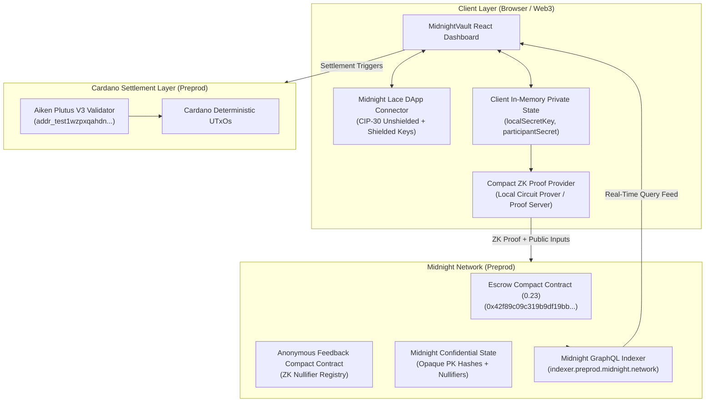

# MidnightVault Protocol Architecture

## 1. Executive Summary & Problem Space

Cross-border freelance and remote collaboration suffers from a fundamental bilateral trust dilemma:
- **Clients / Buyers** refuse to pay upfront for unverified or undelivered work.
- **Freelancers / Sellers** cannot afford to risk uncompensated labor or arbitrary payment freezes by centralized platforms charging 10–20% intermediary fees.
- **Public Blockchains** inadvertently expose sensitive business relationships, client payrolls, and transaction histories to the entire world.

**MidnightVault** eliminates trusted intermediaries by locking milestone funds in **Midnight Network Zero-Knowledge Compact smart contracts** and Cardano settlement layers. Payments are governed by mathematically verified ZK circuits and signature checks — no platform admin, intermediary, or backend server can divert funds.

---

## 2. Dual-Chain & Zero-Knowledge Protocol Architecture

MidnightVault leverages the confidential computing capabilities of **Midnight Network** (Compact ZK-SNARKs) alongside the deterministic settlement guarantees of **Cardano**.

---

## 3. Midnight Compact Smart Contract Engine

The core privacy-preserving logic resides in `contracts-midnight/escrow/` and `contracts-midnight/feedback/`, compiled with Midnight Compact `0.23+`:

### A. Milestone Escrow Circuit (`escrow.compact`)
1. **Public State**:
   - `state: EscrowState` (`AWAITING_DEPOSIT`, `LOCKED`, `RELEASED`, `REFUNDED`, `RESOLVED`)
   - `milestoneAmount: Uint<64>`
   - `buyerPk: Bytes<32>`, `sellerPk: Bytes<32>`, `arbiterPk: Bytes<32>` (One-way persistent key hashes)
2. **Private Witness (`localSecretKey`)**:
   - Stored strictly in browser client RAM.
   - Proved via zero-knowledge circuits without exposing secret keys over the wire.
3. **Circuits**:
   - `deposit()`: Transitions state from `AWAITING_DEPOSIT` to `LOCKED`.
   - `release()`: Proves buyer authorization and triggers seller payout.
   - `refund()`: Proves buyer refund eligibility after deadline.
   - `resolve()` / `resolveSplit()`: Designated arbiter tie-breaker.

### B. Anonymous Feedback & Reputation Circuit (`feedback.compact`)
1. **Verifiable Participation**: Participants prove possession of an authentic witness token without linking to their public wallet.
2. **Anti-Double-Voting Nullifier**:
   $$\text{Nullifier} = \text{PersistentHash}([\text{"midnightvault:nullifier:"}, \text{ParticipantSecret}, \text{SurveyTopic}])$$
3. **Selective Disclosure**: Only public aggregations (`totalResponses`, `totalRatingSum`) and used nullifiers are recorded on-chain.

---

## 4. Privacy & Threat Model: Observer Information Boundary

| Data Asset | Visibility | Technical & Cryptographic Guarantee |
| :--- | :---: | :--- |
| **Contract State & Aggregations** | 🌐 **PUBLIC** | Public ledger tallies (`totalResponses`, `averageScore`, `state`, `milestoneAmount`) |
| **Cryptographic Nullifiers** | 🌐 **PUBLIC** | 32-byte Blake2b hash preventing duplicate actions while concealing identity |
| **Disclosed Key Hashes** | 🌐 **PUBLIC** | Derived public hashes published deliberately via `disclose()` |
| **Off-Chain Identity / IP** | 🔒 **CONFIDENTIAL** | Never recorded on-chain or broadcast in transactions |
| **Private Witness Secrets** | 🔒 **CONFIDENTIAL** | Retained strictly in client memory (`localSecretKey`, `participantSecret`) |
| **Transaction Counterparty Graphs** | 🔒 **CONFIDENTIAL** | Zero-knowledge proofs decouple reputations and review submissions from counterparties |

---

## 5. Client Integration & Tooling Stack

- **Lace DApp Connector (CIP-30)**: Native browser extension integration supporting unshielded (`mn_unshielded1...`) and shielded addresses on Midnight Preprod.
- **Midnight Indexer (GraphQL)**: Real-time synchronization with network blocks and contract storage at `indexer.preprod.midnight.network/api/v4/graphql`.
- **Observable Privacy Behavior Studio**: Interactive side-by-side frontend inspector (`MidnightPrivacyInspector.tsx`) demonstrating client witness state vs. public chain state.
- **Frontend Dashboard**: Vite, React 18, TypeScript, and Vitest test suite.
- **Automated CI/CD**: Matrix GitHub Actions testing Compact circuits, backend APIs, and Vite frontend builds.

---

## 6. Live Preprod Deployments & Network Verification

- **Midnight Preprod Escrow Contract**: `0x42f89c09c319b9df19bb23dae267104b205312f275e771e7a6858066bb739ae0`
- **Cardano Preprod Validator Address**: `addr_test1wzpxqahdn4aqzwuc5x9hc94m0ljqhnc8e9tknca65nm6rdctz5fc9`
- **Deployer Wallet**: `mn_unshielded1qqg8u0k92u089w2345v8d7f6z4k9a2j4m7n5p`
- **Deployment Spec**: [`docs/midnight-deployment.json`](midnight-deployment.json)
- **On-Chain Traffic Records**: [`docs/midnight-activity.json`](midnight-activity.json) & [`docs/MIDNIGHT_ONCHAIN_TX_LIST.md`](MIDNIGHT_ONCHAIN_TX_LIST.md)
